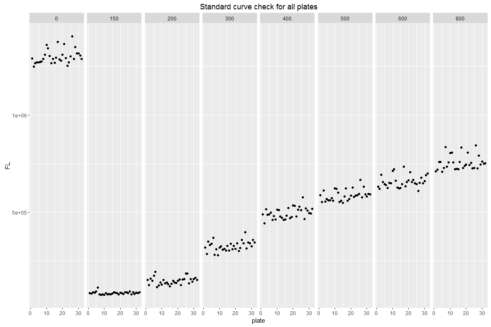
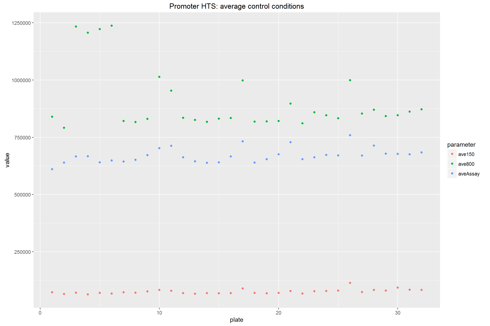
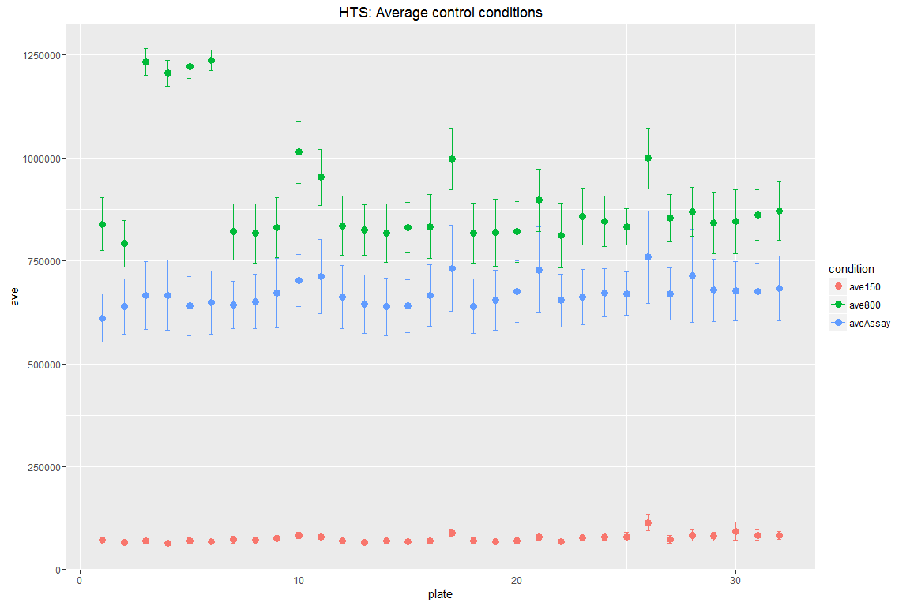
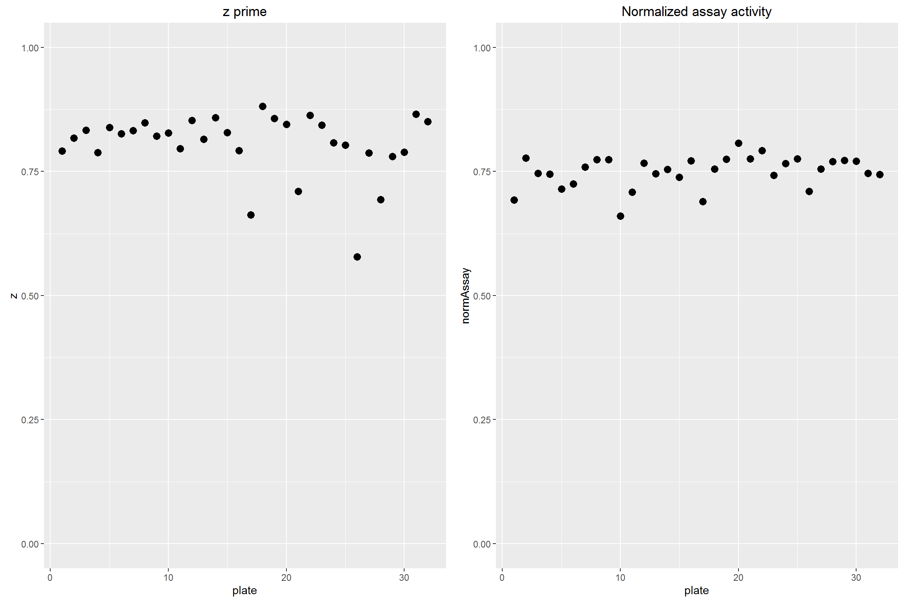
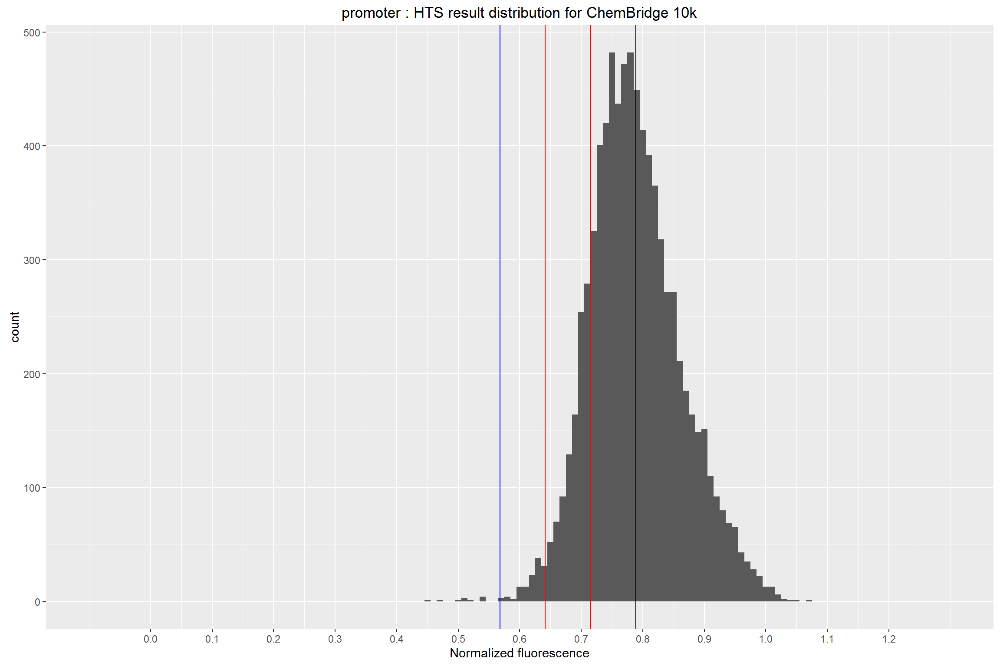
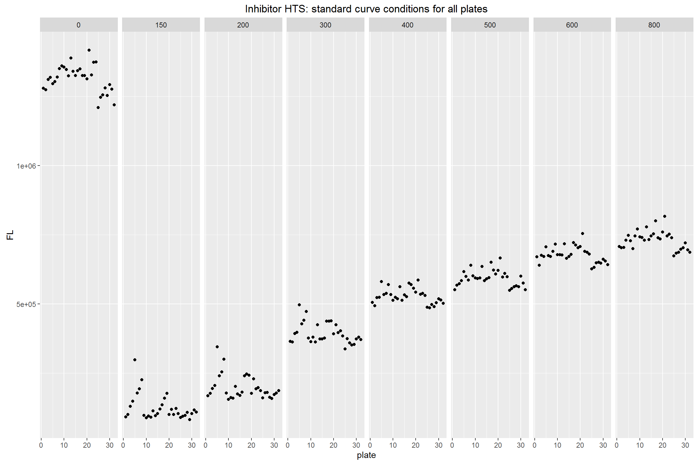
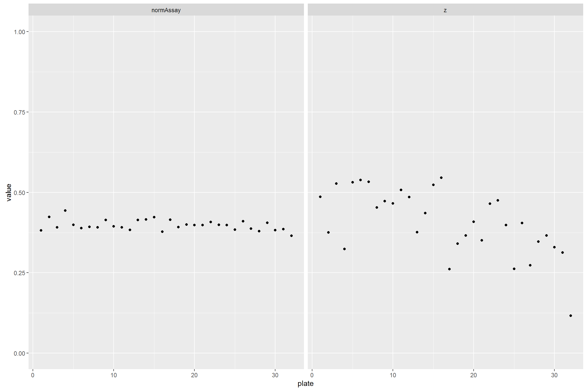
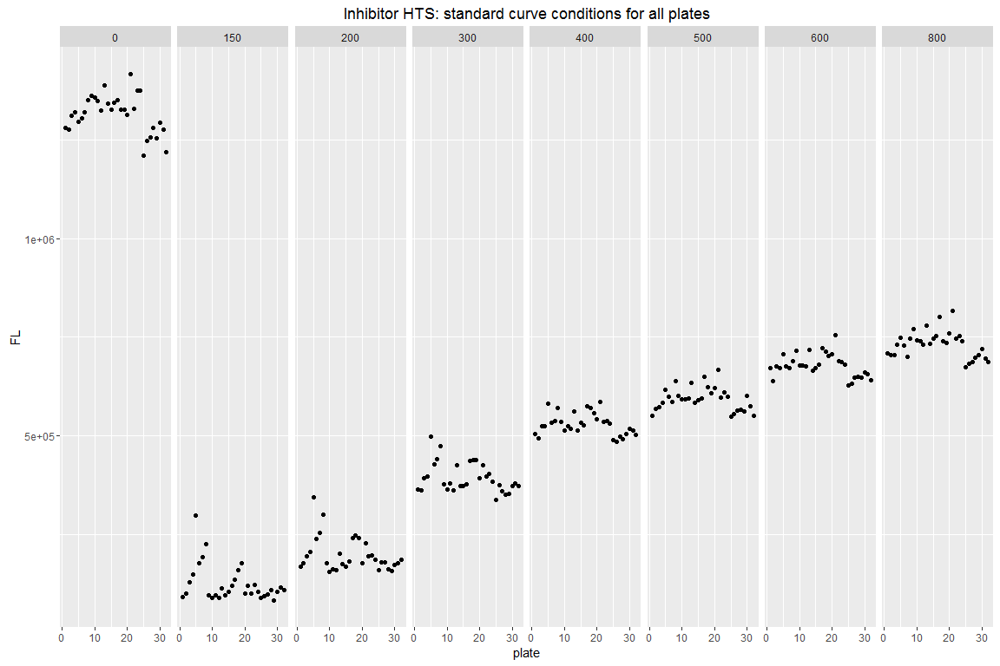
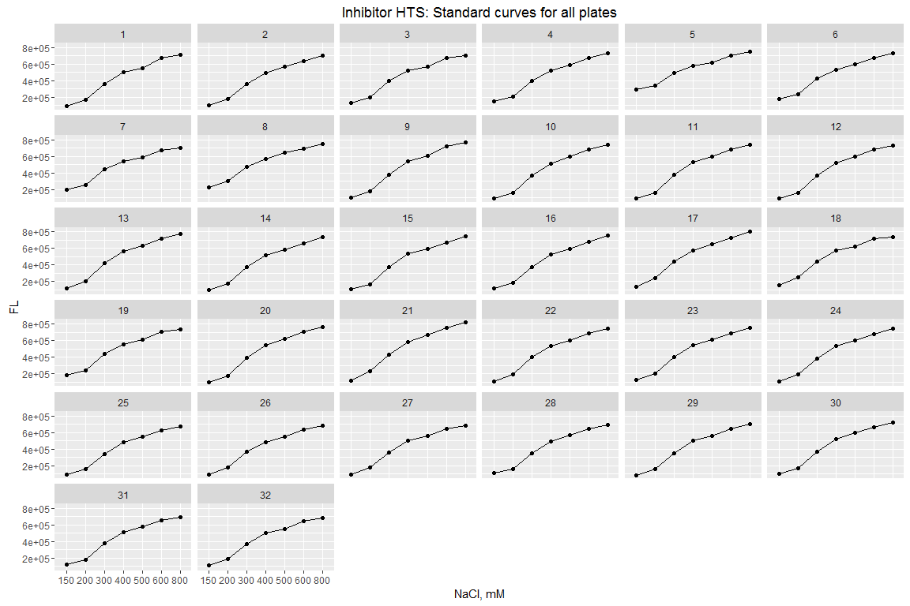
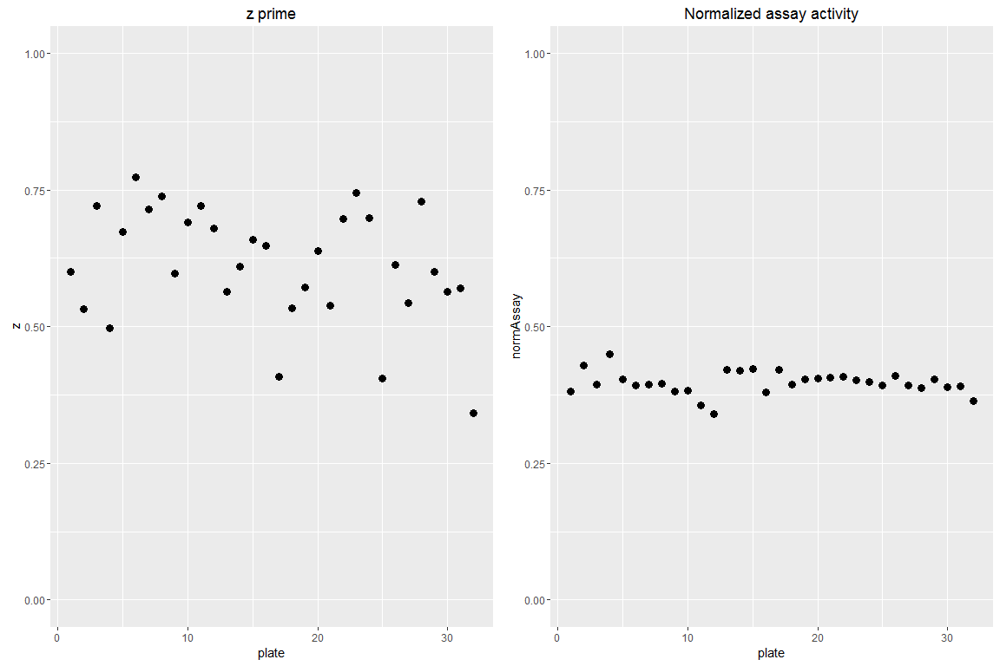

High Throughput Screen (HTS) Analysis
================
Zhenning Tan
September 30, 2016

Promoter HTS
------------

### Create a function to read all plates into a list

    ## [1] 32

    ## [1] 32

### Calculate average, standard deviation, coefficient of variation, z prime for each plate

    ##     plate type aveAssay ave150  ave800 sdAssay sd150 sd800 cvAssay  cv150
    ## X1      1    1   611027  72649  839527   58571  6518 64668  0.0959 0.0897
    ## X2      2    1   639132  65271  791664   66706  5303 57048  0.1044 0.0812
    ## X3      3    1   666199  70788 1233747   82800  5546 32149  0.1243 0.0783
    ## X4      4    1   666961  63885 1206563   85489  6108 31677  0.1282 0.0956
    ## X5      5    1   640441  69842 1222277   72042  7335 29460  0.1125 0.1050
    ## X6      6    1   649030  67804 1237157   76972  6172 24908  0.1186 0.0910
    ## X7      7    1   643516  73268  820940   57827  8971 67734  0.0899 0.1224
    ## X8      8    1   651528  71006  816599   66701  8374 71923  0.1024 0.1179
    ## X9      9    1   671887  76468  830619   83589  7200 72460  0.1244 0.0942
    ## X10    10    1   702120  83134 1013993   63100  6973 75809  0.0899 0.0839
    ## X11    11    1   712135  79233  953380   89546  5639 68264  0.1257 0.0712
    ## X12    12    1   662819  69409  835336   76365  5522 72453  0.1152 0.0796
    ## X13    13    1   644901  66450  825365   71433  5372 61143  0.1108 0.0808
    ## X14    14    1   638698  69012  817434   69462  6839 71165  0.1088 0.0991
    ## X15    15    1   640702  68010  831413   64234  4590 61145  0.1003 0.0675
    ## X16    16    1   666247  69060  833747   74479  6257 76959  0.1118 0.0906
    ## X17    17    1   731942  89349  997650  103914  8068 74470  0.1420 0.0903
    ## X18    18    1   639531  70252  817840   66148  6891 72614  0.1034 0.0981
    ## X19    19    1   654096  68246  818924   72838  5988 81652  0.1114 0.0877
    ## X20    20    1   675932  70677  820594   74800  6693 73859  0.1107 0.0947
    ## X21    21    1   728058  78724  897235  104051  6177 76092  0.1429 0.0785
    ## X22    22    1   654325  67535  811052   64001  4881 78499  0.0978 0.0723
    ## X23    23    1   662218  77244  858586   67638  4636 69103  0.1021 0.0600
    ## X24    24    1   672431  78601  845919   58258  6125 61244  0.0866 0.0779
    ## X25    25    1   670411  80429  832729   52924 10029 43503  0.0789 0.1247
    ## X26    26    1   759279 114303  998992  112064 19554 73892  0.1476 0.1711
    ## X27    27    1   669917  74275  853678   62745  9617 57947  0.0937 0.1295
    ## X28    28    1   713505  83287  869644  113236 13623 58965  0.1587 0.1636
    ## X29    29    1   678696  80538  841876   76437 10349 74452  0.1126 0.1285
    ## X30    30    1   677376  93458  845696   71773 21814 77638  0.1060 0.2334
    ## X31    31    1   675398  84212  861469   68798 12204 61340  0.1019 0.1449
    ## X32    32    1   683382  83467  871506   79454  9157 70388  0.1163 0.1097
    ##      cv800      z normAssay
    ## X1  0.0770 0.6373    0.7020
    ## X2  0.0721 0.6236    0.7900
    ## X3  0.0261 0.5549    0.5120
    ## X4  0.0263 0.5444    0.5278
    ## X5  0.0241 0.5827    0.4951
    ## X6  0.0201 0.5709    0.4970
    ## X7  0.0825 0.6486    0.7627
    ## X8  0.0881 0.6120    0.7786
    ## X9  0.0872 0.5426    0.7895
    ## X10 0.0748 0.6604    0.6650
    ## X11 0.0716 0.5488    0.7240
    ## X12 0.0867 0.5860    0.7748
    ## X13 0.0741 0.6017    0.7622
    ## X14 0.0871 0.5982    0.7612
    ## X15 0.0735 0.6395    0.7502
    ## X16 0.0923 0.5944    0.7810
    ## X17 0.0746 0.4772    0.7075
    ## X18 0.0888 0.6151    0.7615
    ## X19 0.0997 0.5964    0.7804
    ## X20 0.0900 0.5961    0.8071
    ## X21 0.0848 0.4907    0.7933
    ## X22 0.0968 0.6478    0.7892
    ## X23 0.0805 0.6293    0.7487
    ## X24 0.0724 0.6747    0.7739
    ## X25 0.0522 0.6799    0.7842
    ## X26 0.0740 0.3878    0.7290
    ## X27 0.0679 0.6355    0.7642
    ## X28 0.0678 0.3961    0.8014
    ## X29 0.0884 0.5647    0.7857
    ## X30 0.0918 0.5192    0.7762
    ## X31 0.0712 0.5890    0.7606
    ## X32 0.0808 0.5569    0.7613

### Make a plot to check the average statistics for each plate

Plates 3-6, prepared in one batch, have relatively low normalized assay condition (~50% vs 75% for other plates). This is caused by abnormally high 800mM NaCl control.In the following data analysis, use the average of all plates in 800 mM NaCl to normalize the data in plate 3-6.

### Check standard curve for each plate

    ##    plate type    150    200    300    400    500    600    800       0
    ## 1      1    1  82840 150698 318392 488096 587650 630330 709242 1289867
    ## 2      2    1  80512 125874 283896 442579 552510 620509 719050 1249722
    ## 3      3    1  87118 156738 348732 515086 610198 692708 757374 1266634
    ## 4      4    1  84306 147184 330338 485816 555059 655526 757958 1271693
    ## 5      5    1  90897 171957 338162 489164 568144 644179 707416 1270348
    ## 6      6    1 111426 192504 368413 496784 560876 639448 726556 1272676
    ## 7      7    1  75639 114338 280302 459330 561587 623696 835456 1274892
    ## 8      8    1  74824 123321 308988 478974 572468 651270 733442 1287188
    ## 9      9    1  77550 138690 277472 463288 558069 647951 755548 1310082
    ## 10    10    1  73406 127361 317972 512056 623206 711538 803810 1359469
    ## 11    11    1  82129 151607 324428 510608 620477 719934 806806 1343092
    ## 12    12    1  77552 133161 306698 476620 600714 661028 756342 1303186
    ## 13    13    1  77848 137854 310504 471732 552718 626382 720357 1265597
    ## 14    14    1  75852 128962 301261 460291 559342 621975 723678 1288906
    ## 15    15    1  80135 118846 326030 462807 546580 623258 720858 1269040
    ## 16    16    1  86870 131968 302248 481822 579786 644494 758676 1295404
    ## 17    17    1  84434 145936 338322 521182 623192 734015 832022 1376068
    ## 18    18    1  83970 137763 309750 468992 557729 633134 727048 1285824
    ## 19    19    1  76449 134770 325278 476217 566702 654938 738100 1280158
    ## 20    20    1  85234 146859 311940 533554 585660 664002 744458 1310944
    ## 21    21    1  83268 152632 340447 532172 626152 705860 806910 1364879
    ## 22    22    1  78908 124067 300747 476665 578648 655030 742742 1293350
    ## 23    23    1  87078 153944 316507 511740 585534 665816 754040 1253568
    ## 24    24    1  87720 155931 356910 526887 586090 649458 726182 1270435
    ## 25    25    1  83808 183176 340540 511348 594213 644624 727525 1302350
    ## 26    26    1  92379 184950 395932 576213 665363 607978 842798 1405240
    ## 27    27    1  75792 134524 312407 464650 576166 651653 726186 1288568
    ## 28    28    1  87696 156523 344919 518546 630800 677564 789882 1349452
    ## 29    29    1  79828 142238 340448 508974 592408 649272 744270 1316864
    ## 30    30    1  84938 155449 323797 495894 580604 659068 761118 1316410
    ## 31    31    1  82554 163120 355980 492696 594020 689292 748658 1305933
    ## 32    32    1  87940 151448 343559 515990 591714 698494 751038 1287266

### Visualize salt conditions in standard curve

Although there are variations in 150mM and 800mM standards, there is no systematic error. These standard curves make sure that each plate reading is normal. These numbers are not used to normalize data. The "0" panel represents oligo only wells.

### Visualize standard curves for all plates

Standard curves look consistent in all plates.

### Analyze the data with the following modifications

1.  remove the first and third wells in column 2, which are assay condition wells with big systematic error
2.  use average 800mM NaCl control to normalize assay condition in plates 3-6

<!-- -->

    ##     plate type aveAssay ave150  ave800 sdAssay sd150 sd800 cvAssay  cv150
    ## X1      1    1   597644  71497  827453   46659  6122 59315  0.0781 0.0856
    ## X2      2    1   617787  64513  780342   32616  5240 51233  0.0528 0.0812
    ## X3      3    1   641523  69698 1229698   27881  5025 30514  0.0435 0.0721
    ## X4      4    1   641177  62824 1201742   38278  5758 30891  0.0597 0.0917
    ## X5      5    1   620246  68389 1219454   30676  6510 27902  0.0495 0.0952
    ## X6      6    1   626244  66472 1234141   31274  5324 25243  0.0499 0.0801
    ## X7      7    1   625603  70794  805976   31881  6235 57709  0.0510 0.0881
    ## X8      8    1   631107  69369  801625   28368  7432 63401  0.0449 0.1071
    ## X9      9    1   644886  75312  815117   35440  6946 63005  0.0550 0.0922
    ## X10    10    1   682422  81288  998370   32933  5002 67240  0.0483 0.0615
    ## X11    11    1   682601  78704  940917   37403  5468 62772  0.0548 0.0695
    ## X12    12    1   641040  68499  820498   31921  5207 64354  0.0498 0.0760
    ## X13    13    1   623281  65475  814766   41035  4931 57820  0.0658 0.0753
    ## X14    14    1   617871  67415  801647   30153  5430 60785  0.0488 0.0805
    ## X15    15    1   622158  67215  819537   36244  4326 55417  0.0583 0.0644
    ## X16    16    1   643600  68389  818775   39422  6385 69941  0.0613 0.0934
    ## X17    17    1   702112  87897  983224   63509  6882 67637  0.0905 0.0783
    ## X18    18    1   618148  69185  801836   24310  6639 62182  0.0393 0.0960
    ## X19    19    1   631065  67325  801376   29719  5729 70989  0.0471 0.0851
    ## X20    20    1   655039  69211  802812   32577  5325 59483  0.0497 0.0769
    ## X21    21    1   695153  78588  882469   52363  6620 67796  0.0753 0.0842
    ## X22    22    1   636337  67088  793966   28552  5017 67778  0.0449 0.0748
    ## X23    23    1   642121  76513  846359   28362  4333 64909  0.0442 0.0566
    ## X24    24    1   655179  77870  832902   36283  6210 53315  0.0554 0.0797
    ## X25    25    1   654491  77677  823148   32046  7096 37317  0.0490 0.0914
    ## X26    26    1   726806 108722  985860   72137 12943 68643  0.0993 0.1190
    ## X27    27    1   651305  73798  842174   36027 10199 52018  0.0553 0.1382
    ## X28    28    1   676635  81458  857680   49937 10987 52570  0.0738 0.1349
    ## X29    29    1   654537  80432  826510   39040 11112 64881  0.0596 0.1382
    ## X30    30    1   654453  89789  828939   27408 19604 67345  0.0419 0.2183
    ## X31    31    1   652465  82018  848689   23642 11418 54101  0.0362 0.1392
    ## X32    32    1   657334  83223  856432   35226  9632 61181  0.0536 0.1157
    ##      cv800      z normAssay ave800c
    ## X1  0.0717 0.6991    0.6960  827453
    ## X2  0.0657 0.7947    0.7729  780342
    ## X3  0.0248 0.8274    0.4930  844979
    ## X4  0.0257 0.7716    0.5078  844979
    ## X5  0.0229 0.7978    0.4794  844979
    ## X6  0.0205 0.8039    0.4794  844979
    ## X7  0.0716 0.7939    0.7547  805976
    ## X8  0.0791 0.8088    0.7671  801625
    ## X9  0.0773 0.7767    0.7699  815117
    ## X10 0.0673 0.8107    0.6555  998370
    ## X11 0.0667 0.7870    0.7004  940917
    ## X12 0.0784 0.8055    0.7614  820498
    ## X13 0.0710 0.7528    0.7444  814766
    ## X14 0.0758 0.8061    0.7497  801647
    ## X15 0.0676 0.7807    0.7376  819537
    ## X16 0.0854 0.7611    0.7666  818775
    ## X17 0.0688 0.6562    0.6860  983224
    ## X18 0.0775 0.8309    0.7493  801836
    ## X19 0.0886 0.8114    0.7680  801376
    ## X20 0.0741 0.8059    0.7986  802812
    ## X21 0.0768 0.7130    0.7670  882469
    ## X22 0.0854 0.8231    0.7831  793966
    ## X23 0.0767 0.8266    0.7347  846359
    ## X24 0.0640 0.7792    0.7646  832902
    ## X25 0.0453 0.7964    0.7738  823148
    ## X26 0.0696 0.5870    0.7047  985860
    ## X27 0.0618 0.7599    0.7516  842174
    ## X28 0.0613 0.6929    0.7668  857680
    ## X29 0.0785 0.7379    0.7695  826510
    ## X30 0.0812 0.7502    0.7639  828939
    ## X31 0.0637 0.8156    0.7441  848689
    ## X32 0.0714 0.7656    0.7425  856432

### Remake plot to examine z prime

### Scale data based on ave150 and ave800c

    ##         3      4      5      6      7      8      9     10     11     12
    ## 1  0.9122 0.8758 0.8699 0.8743 0.7981 0.8943 0.9341 0.8926 0.8988 0.9404
    ## 2  0.9067 0.8994 0.9403 0.8819 0.9319 0.8868 0.9396 0.9179 0.9459 0.8866
    ## 3  0.8366 0.7257 0.8772 0.8111 0.8613 0.8637 0.8832 0.8985 0.8888 0.9234
    ## 4  0.7873 0.7758 0.8628 0.7437 0.8518 0.8612 0.8612 0.9060 0.8717 0.7819
    ## 5  0.7948 0.7421 0.7185 0.6568 0.7116 0.7412 0.7587 0.8166 0.8020 0.8366
    ## 6  0.7785 0.7325 0.6558 0.7430 0.7039 0.7154 0.7850 0.8001 0.8041 0.8052
    ## 7  0.6379 0.7054 0.7016 0.7207 0.7543 0.7318 0.7259 0.8676 0.7591 0.7945
    ## 8  0.7555 0.7251 0.6778 0.6693 0.7254 0.7480 0.8402 0.7071 0.7586 0.7106
    ## 9  0.6720 0.7189 0.6688 0.6235 0.6820 0.6688 0.6381 0.6932 0.7093 0.7225
    ## 10 0.6442 0.6979 0.7304 0.6572 0.6832 0.6704 0.7076 0.6800 0.7040 0.6827
    ## 11 0.7570 0.6551 0.7384 0.6781 0.7204 0.7490 0.7117 0.6802 0.6824 0.6635
    ## 12 0.7235 0.7635 0.7510 0.6991 0.6712 0.7207 0.6869 0.7075 0.7369 0.6837
    ## 13 0.6727 0.6616 0.6438 0.6590 0.6720 0.6902 0.6616 0.6241 0.6555 0.6592
    ## 14 0.6934 0.6600 0.7051 0.6999 0.6908 0.6717 0.6823 0.6859 0.7124 0.7004
    ## 15 0.6489 0.6655 0.6918 0.6714 0.6802 0.6558 0.6397 0.6815 0.6706 0.7198
    ## 16 0.7245 0.6998 0.7060 0.6547 0.7009 0.7018 0.6702 0.6422 0.6838 0.7119
    ##        13     14     15     16     17     18     19     20     21     22
    ## 1  0.9292 0.9107 0.9246 0.9155 0.9470 0.9071 0.9312 0.8204 0.9872 0.9416
    ## 2  0.9101 0.9262 0.9764 0.9164 0.9783 0.9190 0.9686 0.9301 1.0761 0.9769
    ## 3  0.8838 0.8725 1.0359 0.9365 0.8841 0.8873 0.8982 0.9099 0.8924 0.9243
    ## 4  0.9255 0.8629 0.8465 0.9600 0.9456 0.9063 0.8279 0.9632 0.9017 0.9292
    ## 5  0.8320 0.7774 0.8277 0.8167 0.8301 0.8541 0.8077 0.8461 0.8024 0.8697
    ## 6  0.7435 0.8545 0.8192 0.8246 0.8366 0.8554 0.8700 0.8543 0.8439 0.7635
    ## 7  0.6993 0.7415 0.8135 0.7681 0.8261 0.7926 0.7858 0.8083 0.8001 0.8358
    ## 8  0.6136 0.8389 0.8031 0.7623 0.7820 0.8389 0.8004 0.7382 0.8095 0.7758
    ## 9  0.6771 0.7643 0.7709 0.7504 0.7241 0.7545 0.7546 0.6586 0.7657 0.8230
    ## 10 0.7404 0.6521 0.8171 0.6723 0.7016 0.7884 0.7313 0.6763 0.7623 0.8000
    ## 11 0.6999 0.6621 0.6787 0.7464 0.8113 0.7836 0.7921 0.7486 0.7643 0.8124
    ## 12 0.6861 0.5341 0.6747 0.7074 0.7137 0.6934 0.7618 0.7548 0.7939 0.7861
    ## 13 0.6259 0.7017 0.7124 0.7144 0.6907 0.7554 0.6893 0.7202 0.7359 0.7282
    ## 14 0.6702 0.7495 0.6542 0.6707 0.7058 0.7256 0.6894 0.6525 0.7301 0.7161
    ## 15 0.6184 0.6889 0.6892 0.7325 0.7598 0.7358 0.7656 0.7484 0.7587 0.7646
    ## 16 0.6932 0.7276 0.7056 0.6942 0.7002 0.7974 0.7354 0.7315 0.7694 0.7276
    ##    plate well
    ## 1      1    A
    ## 2      1    B
    ## 3      1    C
    ## 4      1    D
    ## 5      1    E
    ## 6      1    F
    ## 7      1    G
    ## 8      1    H
    ## 9      1    I
    ## 10     1    J
    ## 11     1    K
    ## 12     1    L
    ## 13     1    M
    ## 14     1    N
    ## 15     1    O
    ## 16     1    P

### Combine all plate data into one data frame

    ## [1] 8740    6

    ##   plate well column     FL type position
    ## 2     1   B3      3 0.9067 TRUE     1_B3
    ## 4     1   D3      3 0.7873 TRUE     1_D3
    ## 5     1   E3      3 0.7948 TRUE     1_E3
    ## 6     1   F3      3 0.7785 TRUE     1_F3
    ## 7     1   G3      3 0.6379 TRUE     1_G3
    ## 8     1   H3      3 0.7555 TRUE     1_H3

    ##       plate well column     FL type position
    ## 10219    31  K22     22 0.8413 TRUE   31_K22
    ## 10220    31  L22     22 0.8154 TRUE   31_L22
    ## 10221    31  M22     22 0.7898 TRUE   31_M22
    ## 10222    31  N22     22 0.8173 TRUE   31_N22
    ## 10223    31  O22     22 0.8131 TRUE   31_O22
    ## 10224    31  P22     22 0.7693 TRUE   31_P22

### Investigate statistics of the dataset and visualize distribution

    ##    Min. 1st Qu.  Median    Mean 3rd Qu.    Max. 
    ##  0.4470  0.7300  0.7755  0.7859  0.8345  1.0760

The black vertical line indicates average. The red vertical lines indicate 1 sigma and 2 sigma mark from the average. The blue vertical lines indicate the 3 sigma mark from the average.

### Summarize the hits

    ##       st count     type percentage
    ## 1  total  8740 promoter     1.0000
    ## 2 sigma2   449 promoter     0.0514
    ## 3 sigma3    22 promoter     0.0025

This table summarizes the hits at 2 sigma and 3 sigma away from the average. I included both directions because there could be strong potential promoters and inhibitors captured in both assay.

Inhibitor HTS
-------------

### Follow the same steps to analyze the inhibitor data set

    ##     plate type aveAssay ave150 ave800 sdAssay sd150 sd800 cvAssay  cv150
    ## X1      1    0   331693  66197 760942   30529  3750 42950  0.0920 0.0566
    ## X2      2    0   362160  66518 764032   33563  4589 50071  0.0927 0.0690
    ## X3      3    0   341428  64422 771836   20951  3402 46804  0.0614 0.0528
    ## X4      4    0   385086  65347 786237   41890  3728 48509  0.1088 0.0570
    ## X5      5    0   365984  89194 782241   28168  8070 36864  0.0770 0.0905
    ## X6      6    0   353768  75761 789792   19605  6703 47457  0.0554 0.0885
    ## X7      7    0   354356  77062 782275   26033 11692 40606  0.0735 0.1517
    ## X8      8    0   358393  81145 789054   20337  8256 58163  0.0567 0.1017
    ## X9      9    0   384900 130393 807227   31009 16322 43218  0.0806 0.1252
    ## X10    10    0   360487 107525 780434   21971 17953 52865  0.0609 0.1670
    ## X11    11    0   359448 130344 784646   19679 17011 50083  0.0547 0.1305
    ## X12    12    0   352585 133513 780320   26635 20695 46734  0.0755 0.1550
    ## X13    13    0   397079  90960 829267   39465  9091 50338  0.0994 0.0999
    ## X14    14    0   365336  73209 776087   23563  5725 53714  0.0645 0.0782
    ## X15    15    0   368403  78623 764103   24516  5859 38312  0.0665 0.0745
    ## X16    16    0   367739  82184 838202   23212  5533 48059  0.0631 0.0673
    ## X17    17    0   418096 102031 863010   45783 11590 63701  0.1095 0.1136
    ## X18    18    0   379292  91454 825700   28039 12261 70117  0.0739 0.1341
    ## X19    19    0   379795  94985 806371   29981 12804 60175  0.0789 0.1348
    ## X20    20    0   383939  92827 822809   25230 11540 61280  0.0657 0.1243
    ## X21    21    0   421052 117072 880570   44864 20551 54514  0.1066 0.1755
    ## X22    22    0   375545  84862 797933   27870  8678 47504  0.0742 0.1023
    ## X23    23    0   381885 102416 803053   21159 34898 52460  0.0554 0.3407
    ## X24    24    0   375335  98418 793086   31381 14142 52337  0.0836 0.1437
    ## X25    25    0   341428  83761 754105   32234 16171 69271  0.0944 0.1931
    ## X26    26    0   346408  88532 717027   32536 16833 41046  0.0939 0.1901
    ## X27    27    0   358652 106270 757315   30631 21095 65978  0.0854 0.1985
    ## X28    28    0   354920 109378 755876   22321 22132 64972  0.0629 0.2023
    ## X29    29    0   353424  75989 760361   31622 13547 54426  0.0895 0.1783
    ## X30    30    0   366358  97346 800223   22134 17497 74782  0.0604 0.1797
    ## X31    31    0   352193  82613 781141   23186 14475 75040  0.0658 0.1752
    ## X32    32    0   341036  83201 789307   42249 13795 89715  0.1239 0.1658
    ##      cv800      z normAssay
    ## X1  0.0564 0.4865    0.3821
    ## X2  0.0655 0.3757    0.4239
    ## X3  0.0606 0.5277    0.3916
    ## X4  0.0617 0.3240    0.4435
    ## X5  0.0471 0.5313    0.3994
    ## X6  0.0601 0.5386    0.3893
    ## X7  0.0519 0.5328    0.3932
    ## X8  0.0737 0.4532    0.3916
    ## X9  0.0535 0.4727    0.3760
    ## X10 0.0677 0.4654    0.3759
    ## X11 0.0638 0.5078    0.3502
    ## X12 0.0599 0.4854    0.3387
    ## X13 0.0607 0.3766    0.4146
    ## X14 0.0692 0.4356    0.4156
    ## X15 0.0501 0.5237    0.4227
    ## X16 0.0573 0.5455    0.3777
    ## X17 0.0738 0.2618    0.4153
    ## X18 0.0849 0.3404    0.3920
    ## X19 0.0746 0.3660    0.4004
    ## X20 0.0745 0.4086    0.3988
    ## X21 0.0619 0.3512    0.3981
    ## X22 0.0595 0.4647    0.4076
    ## X23 0.0653 0.4756    0.3989
    ## X24 0.0660 0.3988    0.3986
    ## X25 0.0919 0.2621    0.3844
    ## X26 0.0572 0.4044    0.4103
    ## X27 0.0871 0.2730    0.3877
    ## X28 0.0860 0.3469    0.3798
    ## X29 0.0716 0.3656    0.4054
    ## X30 0.0935 0.3299    0.3827
    ## X31 0.0961 0.3130    0.3859
    ## X32 0.1137 0.1168    0.3652

Control 150mM NaCl condition has big variations in some plates.

    ##     plate type aveAssay ave150 ave800 sdAssay sd150 sd800 cvAssay  cv150
    ## X1      1    0   331693  66197 760942   30529  3750 42950  0.0920 0.0566
    ## X2      2    0   362160  66518 764032   33563  4589 50071  0.0927 0.0690
    ## X3      3    0   341428  64422 771836   20951  3402 46804  0.0614 0.0528
    ## X4      4    0   385086  65347 786237   41890  3728 48509  0.1088 0.0570
    ## X5      5    0   365984  89194 782241   28168  8070 36864  0.0770 0.0905
    ## X6      6    0   353768  75761 789792   19605  6703 47457  0.0554 0.0885
    ## X7      7    0   354356  77062 782275   26033 11692 40606  0.0735 0.1517
    ## X8      8    0   358393  81145 789054   20337  8256 58163  0.0567 0.1017
    ## X9      9    0   384900 130393 807227   31009 16322 43218  0.0806 0.1252
    ## X10    10    0   360487 107525 780434   21971 17953 52865  0.0609 0.1670
    ## X11    11    0   359448 130344 784646   19679 17011 50083  0.0547 0.1305
    ## X12    12    0   352585 133513 780320   26635 20695 46734  0.0755 0.1550
    ## X13    13    0   397079  90960 829267   39465  9091 50338  0.0994 0.0999
    ## X14    14    0   365336  73209 776087   23563  5725 53714  0.0645 0.0782
    ## X15    15    0   368403  78623 764103   24516  5859 38312  0.0665 0.0745
    ## X16    16    0   367739  82184 838202   23212  5533 48059  0.0631 0.0673
    ## X17    17    0   418096 102031 863010   45783 11590 63701  0.1095 0.1136
    ## X18    18    0   379292  91454 825700   28039 12261 70117  0.0739 0.1341
    ## X19    19    0   379795  94985 806371   29981 12804 60175  0.0789 0.1348
    ## X20    20    0   383939  92827 822809   25230 11540 61280  0.0657 0.1243
    ## X21    21    0   421052 117072 880570   44864 20551 54514  0.1066 0.1755
    ## X22    22    0   375545  84862 797933   27870  8678 47504  0.0742 0.1023
    ## X23    23    0   381885 102416 803053   21159 34898 52460  0.0554 0.3407
    ## X24    24    0   375335  98418 793086   31381 14142 52337  0.0836 0.1437
    ## X25    25    0   341428  83761 754105   32234 16171 69271  0.0944 0.1931
    ## X26    26    0   346408  88532 717027   32536 16833 41046  0.0939 0.1901
    ## X27    27    0   358652 106270 757315   30631 21095 65978  0.0854 0.1985
    ## X28    28    0   354920 109378 755876   22321 22132 64972  0.0629 0.2023
    ## X29    29    0   353424  75989 760361   31622 13547 54426  0.0895 0.1783
    ## X30    30    0   366358  97346 800223   22134 17497 74782  0.0604 0.1797
    ## X31    31    0   352193  82613 781141   23186 14475 75040  0.0658 0.1752
    ## X32    32    0   341036  83201 789307   42249 13795 89715  0.1239 0.1658
    ##      cv800      z normAssay ave150c
    ## X1  0.0564 0.4865    0.3821   66197
    ## X2  0.0655 0.3757    0.4239   66518
    ## X3  0.0606 0.5277    0.3916   64422
    ## X4  0.0617 0.3240    0.4435   65347
    ## X5  0.0471 0.5313    0.3994   89194
    ## X6  0.0601 0.5386    0.3893   75761
    ## X7  0.0519 0.5328    0.3932   77062
    ## X8  0.0737 0.4532    0.3916   81145
    ## X9  0.0535 0.4727    0.4140   86492
    ## X10 0.0677 0.4654    0.3948   86492
    ## X11 0.0638 0.5078    0.3910   86492
    ## X12 0.0599 0.4854    0.3835   86492
    ## X13 0.0607 0.3766    0.4146   90960
    ## X14 0.0692 0.4356    0.4156   73209
    ## X15 0.0501 0.5237    0.4227   78623
    ## X16 0.0573 0.5455    0.3777   82184
    ## X17 0.0738 0.2618    0.4153  102031
    ## X18 0.0849 0.3404    0.3920   91454
    ## X19 0.0746 0.3660    0.4004   94985
    ## X20 0.0745 0.4086    0.3988   92827
    ## X21 0.0619 0.3512    0.3981  117072
    ## X22 0.0595 0.4647    0.4076   84862
    ## X23 0.0653 0.4756    0.3989  102416
    ## X24 0.0660 0.3988    0.3986   98418
    ## X25 0.0919 0.2621    0.3844   83761
    ## X26 0.0572 0.4044    0.4103   88532
    ## X27 0.0871 0.2730    0.3877  106270
    ## X28 0.0860 0.3469    0.3798  109378
    ## X29 0.0716 0.3656    0.4054   75989
    ## X30 0.0935 0.3299    0.3827   97346
    ## X31 0.0961 0.3130    0.3859   82613
    ## X32 0.1137 0.1168    0.3652   83201

    ##   plate type parameter  value
    ## 1     1    0  aveAssay 331693
    ## 2     2    0  aveAssay 362160
    ## 3     3    0  aveAssay 341428
    ## 4     4    0  aveAssay 385086
    ## 5     5    0  aveAssay 365984
    ## 6     6    0  aveAssay 353768

    ## [1] 384   4

### Check control conditions for all plates

### Check standard curve for each plate

    ##    plate type    150    200    300    400    500    600    800       0
    ## 1      1    0  91692 168700 364524 505674 551308 670992 708018 1279536
    ## 2      2    0 100742 177719 362506 493699 568398 639513 703710 1274646
    ## 3      3    0 129902 194496 393564 523642 573758 676362 703989 1311280
    ## 4      4    0 148508 206158 397991 523900 584804 671302 730199 1318927
    ## 5      5    0 297904 345438 497244 580992 616871 706420 748496 1296310
    ## 6      6    0 178510 240082 428185 534252 599277 675065 728534 1303634
    ## 7      7    0 193925 255203 441658 538471 586010 671776 700473 1319518
    ## 8      8    0 226374 300526 473584 570566 639602 689954 745960 1350056
    ## 9      9    0  97356 178222 376705 534588 601516 715930 771005 1360326
    ## 10    10    0  88822 155327 364252 513156 593756 678324 742890 1356354
    ## 11    11    0  95422 162478 380397 524872 592550 678062 740725 1347356
    ## 12    12    0  90898 159731 362593 519021 594227 676911 730366 1324667
    ## 13    13    0 113592 202346 425182 562342 635122 717758 778549 1388322
    ## 14    14    0  96620 175586 373517 513100 584494 664718 732277 1340439
    ## 15    15    0 104166 169558 373940 533263 591435 671483 745978 1325794
    ## 16    16    0 120040 182061 377306 526832 595600 679797 753292 1343058
    ## 17    17    0 136153 241070 437818 575460 650416 721924 800591 1349510
    ## 18    18    0 159283 247016 438349 570474 622488 713272 739164 1325756
    ## 19    19    0 177226 242248 439232 557610 607861 702794 734732 1325942
    ## 20    20    0 100612 177055 392546 543089 621414 707538 759654 1313680
    ## 21    21    0 119567 229282 425202 586153 666392 754907 816404 1417079
    ## 22    22    0 101038 194188 397089 535219 597916 690194 746270 1327523
    ## 23    23    0 123078 198096 402811 538900 610072 686871 752880 1373412
    ## 24    24    0 104485 187328 384876 531382 598941 680946 739786 1374812
    ## 25    25    0  89980 160938 337732 488592 549534 626932 673352 1210062
    ## 26    26    0  94218 179488 374424 486121 555564 632139 683818 1246606
    ## 27    27    0  97822 180569 359346 498636 563074 648600 686628 1255548
    ## 28    28    0 108910 163221 351948 490754 565965 650707 698145 1280866
    ## 29    29    0  82266 158698 354428 504280 562136 647626 703602 1253344
    ## 30    30    0 104540 172760 373434 519100 600816 661342 720966 1292334
    ## 31    31    0 117219 178030 379782 514282 575728 655709 695906 1275808
    ## 32    32    0 109687 187516 372038 502248 551614 642072 686566 1219149

    ##   plate type NaCl     FL
    ## 1     1    0  150  91692
    ## 2     2    0  150 100742
    ## 3     3    0  150 129902
    ## 4     4    0  150 148508
    ## 5     5    0  150 297904
    ## 6     6    0  150 178510

### Visualize salt conditions in standard curve

### Visualize standard curves for all plates

### Scale data based on ave150c and ave800

    ##         3      4      5      6      7      8      9     10     11     12
    ## 1  0.4928 0.4599 0.4803 0.4531 0.4789 0.4834 0.5173 0.4817 0.4939 0.5171
    ## 2  0.4825 0.4600 0.4991 0.4679 0.5091 0.4914 0.4838 0.5052 0.4611 0.4982
    ## 3  0.4216 0.4502 0.4616 0.4308 0.4527 0.4434 0.4648 0.4739 0.4436 0.5770
    ## 4  0.4438 0.4258 0.4151 0.4119 0.4676 0.4253 0.4223 0.4366 0.4906 0.3563
    ## 5  0.4642 0.4049 0.3928 0.3817 0.3842 0.3841 0.4306 0.4695 0.3972 0.4322
    ## 6  0.4564 0.3961 0.3858 0.3986 0.4184 0.3915 0.4352 0.3948 0.4056 0.4507
    ## 7  0.3676 0.3973 0.3769 0.4200 0.3644 0.4128 0.4268 0.4521 0.3773 0.4213
    ## 8  0.4346 0.3595 0.3638 0.3358 0.3437 0.4560 0.4989 0.4020 0.3942 0.3749
    ## 9  0.3256 0.3749 0.3237 0.3319 0.3811 0.3425 0.3411 0.3704 0.3833 0.3721
    ## 10 0.3880 0.3907 0.4430 0.3732 0.3805 0.3492 0.3971 0.3612 0.4038 0.3461
    ## 11 0.4412 0.3537 0.4221 0.3439 0.3550 0.4985 0.4350 0.4121 0.3476 0.3692
    ## 12 0.3441 0.4248 0.4369 0.3974 0.3971 0.4046 0.3660 0.3756 0.4198 0.4164
    ## 13 0.3414 0.3411 0.3321 0.3487 0.3411 0.3639 0.3921 0.3358 0.3629 0.3579
    ## 14 0.3658 0.3549 0.3494 0.3687 0.3719 0.3614 0.3748 0.3632 0.3860 0.3678
    ## 15 0.3732 0.3423 0.4144 0.3018 0.3686 0.3646 0.3649 0.3939 0.3506 0.3939
    ## 16 0.4522 0.3591 0.3816 0.3803 0.3815 0.3779 0.3511 0.3455 0.3669 0.3999
    ##        13     14     15     16     17     18     19     20     21     22
    ## 1  0.4991 0.4903 0.4575 0.4876 0.4857 0.4767 0.5162 0.4024 0.5008 0.5052
    ## 2  0.4640 0.4802 0.6090 0.4772 0.5127 0.4617 0.4763 0.4661 0.7086 0.4929
    ## 3  0.4785 0.4737 0.6964 0.4982 0.4538 0.4529 0.4825 0.4779 0.4840 0.4689
    ## 4  0.4377 0.4607 0.4320 0.4825 0.4456 0.4739 0.4216 0.4709 0.4446 0.4924
    ## 5  0.4371 0.3826 0.4564 0.4378 0.4327 0.4641 0.4297 0.4136 0.4389 0.4633
    ## 6  0.3967 0.4510 0.4305 0.4310 0.4904 0.4995 0.4908 0.4780 0.4494 0.4329
    ## 7  0.3583 0.4066 0.4271 0.4186 0.4057 0.4273 0.4440 0.4312 0.3897 0.4629
    ## 8  0.3129 0.3906 0.3723 0.4010 0.4279 0.4036 0.3815 0.4372 0.4298 0.5447
    ## 9  0.3837 0.3749 0.3892 0.3937 0.4058 0.3727 0.3945 0.2772 0.4100 0.4613
    ## 10 0.3911 0.3530 0.4724 0.3621 0.3826 0.3903 0.3767 0.3900 0.4285 0.4266
    ## 11 0.4037 0.4134 0.3910 0.4663 0.4146 0.5082 0.4211 0.4357 0.4435 0.4467
    ## 12 0.3587 0.2194 0.3555 0.4185 0.3845 0.4082 0.4338 0.4235 0.4201 0.4509
    ## 13 0.3258 0.4288 0.4201 0.4360 0.3756 0.3621 0.3774 0.3923 0.3916 0.4320
    ## 14 0.3511 0.4559 0.3679 0.3558 0.3783 0.4155 0.3634 0.3759 0.3839 0.3661
    ## 15 0.2671 0.3758 0.3869 0.3912 0.4312 0.3849 0.4124 0.4185 0.4048 0.4088
    ## 16 0.3860 0.4708 0.3788 0.3842 0.4005 0.4592 0.3954 0.3622 0.4228 0.3847
    ##    plate well
    ## 1      1    A
    ## 2      1    B
    ## 3      1    C
    ## 4      1    D
    ## 5      1    E
    ## 6      1    F
    ## 7      1    G
    ## 8      1    H
    ## 9      1    I
    ## 10     1    J
    ## 11     1    K
    ## 12     1    L
    ## 13     1    M
    ## 14     1    N
    ## 15     1    O
    ## 16     1    P

### Combine all plate data into one piece

    ## [1] 8740    6

    ##   plate well column     FL  type position
    ## 2     1   B3      3 0.4825 FALSE     1_B3
    ## 4     1   D3      3 0.4438 FALSE     1_D3
    ## 5     1   E3      3 0.4642 FALSE     1_E3
    ## 6     1   F3      3 0.4564 FALSE     1_F3
    ## 7     1   G3      3 0.3676 FALSE     1_G3
    ## 8     1   H3      3 0.4346 FALSE     1_H3

### Investigate statistics of the dataset and visualize distribution

    ##    Min. 1st Qu.  Median    Mean 3rd Qu.    Max. 
    ##  0.1284  0.3772  0.4098  0.4171  0.4513  1.0220

    ##       st count      type percentage
    ## 1  total  8740 inhibitor     1.0000
    ## 2 sigma2   361 inhibitor     0.0413
    ## 3 sigma3    71 inhibitor     0.0081

### Find intersect of two HTS

    ##    position pro.hts.fl inh.hts.fl
    ## 1     1_B21     1.0761     0.7086
    ## 2     1_L14     0.5341     0.2194
    ## 3    13_L14     0.5315     0.2048
    ## 4     16_K8     0.5299     0.1859
    ## 5    18_J12     0.5150     0.1540
    ## 6    19_N16     0.5047     0.1936
    ## 7      2_P8     0.4678     0.1866
    ## 8     22_L6     0.5035     0.1284
    ## 9    24_J19     0.4977     0.1391
    ## 10   30_B11     1.0303     0.6199
    ## 11   30_D20     1.0348     0.6252
    ## 12     5_N8     0.5305     0.1745
    ## 13     6_H5     0.5053     0.1864
    ## 14    6_J16     0.4470     0.1317

There are 152 common compounds shown as hits in both assays with 2 sigma away from mean. There are 14 common compounds shown as hits in both assays with 3 sigma away from mean. The later list is shown above
