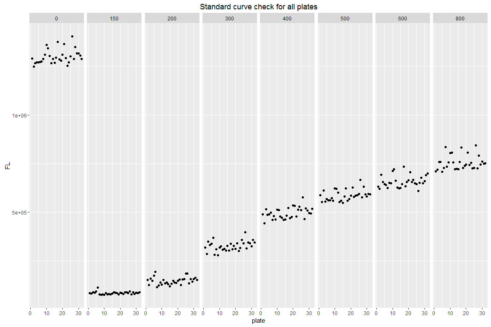
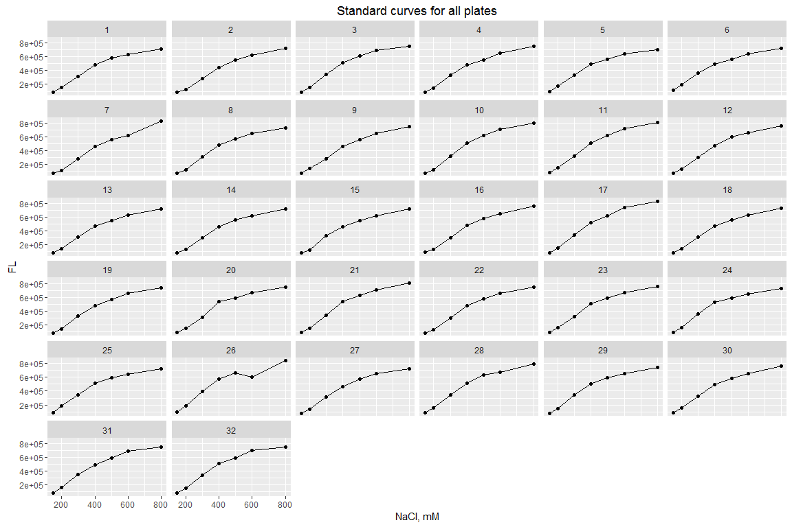
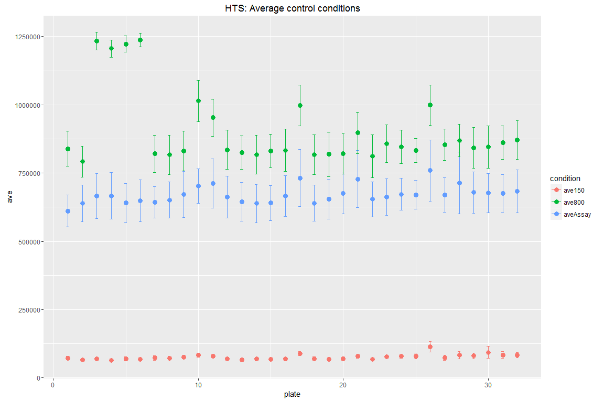
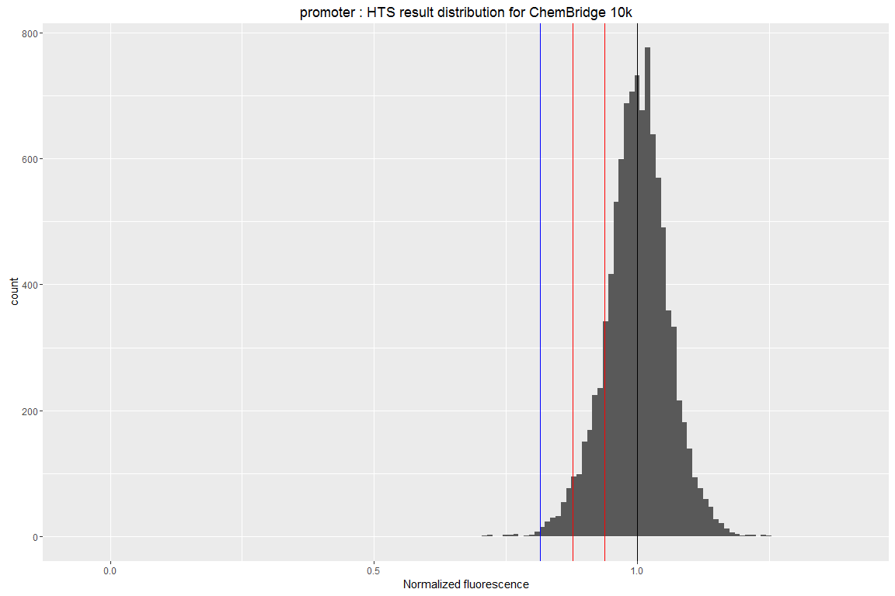
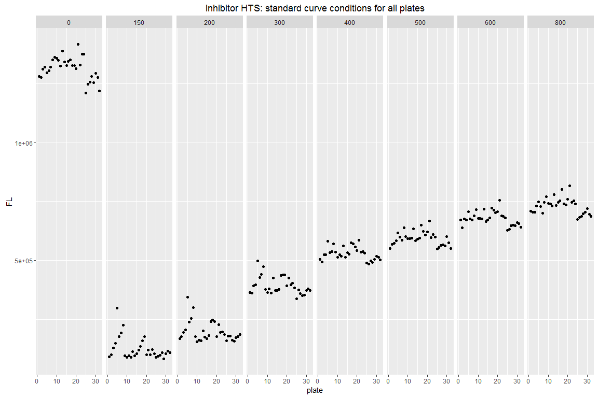
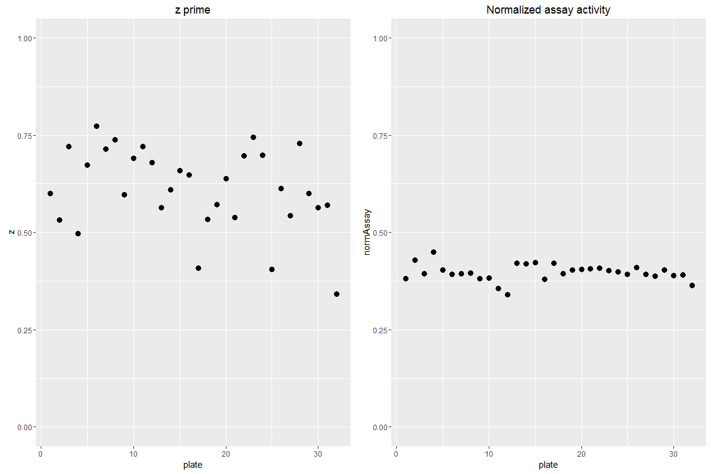

High Throughput Screen (HTS) Analysis
================
Zhenning Tan
September 30, 2016

``` r
#install and load necessary packages
library(ggplot2)
library(tidyr)
library(gridExtra)
```

### 1. Summary

This document is an analysis of HTS output data from a 10k library. Due to confidentiality., any library or compounds identification are removed. The goal of this analysis is to show the work flow of HTS analysis. Any adivce is welcome. **Note:** to eliminate the effect of systematic error during sample dispensing, *each data point is divided by the average of the same well data points in 32 plates.*

### 2. Experimental steps

This section is removed due to confidentiality.

### 3. Result analysis

#### Read all plates into a list

``` r
# remember to set work directory 

readAll <- function(number, prefix){
  output <- list()
  for (i in c(1:number)){
    input <- paste0(prefix,"_p",i)
    data <- read.csv(input, header = FALSE)
    colnames(data) <- seq(1,24)   #change column names to 1-24
    rownames(data) <- LETTERS[1:16] #change row names to A to P
    output[[i]] <- data
  }
  return(output)
}

proplates <- readAll(32, "20160929_promoter")
inhplates <- readAll(32, "20160930_inhibitor")
np <- length(proplates)
ni <- length(inhplates)
```

There are 32 plates in promoter HTS. There are 32 plates in inhibitor HTS.

### 3.1 Promoter HTS

#### Check standard curve for each plate

``` r
#make standard curve table
standardTable <- function(plates, type){
  standard.table <- data.frame(matrix(NA, nrow = 10, ncol = 32))
  for(i in c(1:32)){
    data <- sapply(1:8, function(x, y) round(mean(y[(x*2-1): (x*2)])), 
                   y = plates[[i]][,1]) 
    t <- type == "promoter" 
    standard.table[,i] <- c(i, t, data)
    }
  # transpose the data frame
  standard.table <- data.frame(t(standard.table))
  
  # add column and row names to the tranposed data frame
  rownames(standard.table) <- c(1:32)
  colnames(standard.table) <- c("plate", "type", "150", "200", "300",
                          "400","500", "600", "800", "0")
  # use 0 to represent oligo control wells
  return(standard.table)
}

pro.standards <- standardTable(proplates, "promoter")
pro.standards
```

    ##    plate type    150    200    300    400    500    600    800       0
    ## 1      1    1  82840 150698 318392 488096 587650 630330 709242 1289867
    ## 2      2    1  80512 125874 283896 442579 552510 620509 719050 1249722
    ## 3      3    1  87118 156738 348732 515086 610198 692708 757374 1266634
    ## 4      4    1  84306 147184 330338 485816 555059 655526 757958 1271693
    ## 5      5    1  90897 171957 338162 489164 568144 644179 707416 1270348
    ## 6      6    1 111426 192504 368413 496784 560876 639448 726556 1272676
    ## 7      7    1  75639 114338 280302 459330 561587 623696 835456 1274892
    ## 8      8    1  74824 123321 308988 478974 572468 651270 733442 1287188
    ## 9      9    1  77550 138690 277472 463288 558069 647951 755548 1310082
    ## 10    10    1  73406 127361 317972 512056 623206 711538 803810 1359469
    ## 11    11    1  82129 151607 324428 510608 620477 719934 806806 1343092
    ## 12    12    1  77552 133161 306698 476620 600714 661028 756342 1303186
    ## 13    13    1  77848 137854 310504 471732 552718 626382 720357 1265597
    ## 14    14    1  75852 128962 301261 460291 559342 621975 723678 1288906
    ## 15    15    1  80135 118846 326030 462807 546580 623258 720858 1269040
    ## 16    16    1  86870 131968 302248 481822 579786 644494 758676 1295404
    ## 17    17    1  84434 145936 338322 521182 623192 734015 832022 1376068
    ## 18    18    1  83970 137763 309750 468992 557729 633134 727048 1285824
    ## 19    19    1  76449 134770 325278 476217 566702 654938 738100 1280158
    ## 20    20    1  85234 146859 311940 533554 585660 664002 744458 1310944
    ## 21    21    1  83268 152632 340447 532172 626152 705860 806910 1364879
    ## 22    22    1  78908 124067 300747 476665 578648 655030 742742 1293350
    ## 23    23    1  87078 153944 316507 511740 585534 665816 754040 1253568
    ## 24    24    1  87720 155931 356910 526887 586090 649458 726182 1270435
    ## 25    25    1  83808 183176 340540 511348 594213 644624 727525 1302350
    ## 26    26    1  92379 184950 395932 576213 665363 607978 842798 1405240
    ## 27    27    1  75792 134524 312407 464650 576166 651653 726186 1288568
    ## 28    28    1  87696 156523 344919 518546 630800 677564 789882 1349452
    ## 29    29    1  79828 142238 340448 508974 592408 649272 744270 1316864
    ## 30    30    1  84938 155449 323797 495894 580604 659068 761118 1316410
    ## 31    31    1  82554 163120 355980 492696 594020 689292 748658 1305933
    ## 32    32    1  87940 151448 343559 515990 591714 698494 751038 1287266

``` r
pro.standards <- gather(pro.standards, NaCl, FL, 3:10, convert = TRUE)
#head(pro.standards)
```

Each column represents a NaCl concentration in mM. The "0" column represents the condition with no NaCl or CP - oligo only wells.

#### Visualize salt conditions in standard curve

``` r
ggplot(data = pro.standards, aes(x= plate, y=FL))+
  geom_point()+
  facet_grid(.~ NaCl)+
  ggtitle("Standard curve check for all plates")
```



Although there are variations in 150mM and 800mM standards, there is no systematic error. These standard curves make sure that each plate reading is normal. These numbers are not used to normalize data. The "0" panel represents oligo only wells. \#\#\#\# Visualize standard curves

``` r
ggplot(data = subset(pro.standards, NaCl != 0), aes(x = NaCl, y = FL))+
  geom_point()+
  geom_line()+
  facet_wrap(~plate)+
  ggtitle("Standard curves for all plates")+
  xlab( "NaCl, mM")
```



Standard curves look consistent in all plates.

#### Calculate average (ave), standard deviation (sd), coefficient of variation (cv), z prime for each plate

``` r
# calculate plate statistics by selecting columns and type promoter/inhibitor 
stats <- function(plate, type, row = 1:16){ 
  aveAssay <- round(mean(plate[row,2]))
  sdAssay <- round(sd(plate[row,2]))
  cvAssay <- round(sdAssay/aveAssay, digits = 4)
  
  ave150 <- round(mean(plate[row,23]))
  sd150 <- round(sd(plate[row,23]))
  cv150 <- round(sd150/ave150, digits =4)
  
  ave800 <- round(mean(plate[row,24]))
  sd800 <- round(sd(plate[row,24]))
  cv800 <- round(sd800/ave800, digits =4)
  
  if(type == "promoter"){
    z <- round(1- 3*(sdAssay + sd150)/(aveAssay - ave150), digits = 4)
  }  else{
    z <- round(1- 3*(sdAssay + sd800)/(ave800 - aveAssay), digits = 4)
  }
  t <- type =="promoter"
  result <- c(t, aveAssay, ave150, ave800, 
              sdAssay, sd150, sd800, 
              cvAssay, cv150, cv800, z)
  return(result)
}

# calculate the statistics for each plate and store them in a table
statTable <- function(plates, type, row = 1:16){
  stat.table <- data.frame(matrix(NA, nrow = 12, ncol = 32))
  for(i in c(1:32)){
    data <- stats(plates[[i]], type, row)
    stat.table[,i] <- c(i, data)
    }
  # transpose the data frame
  stat.table <- data.frame(t(stat.table))
  
  # add column and row names to the tranposed data frame
  #rownames(stat.table) <- c(1:32)
  colnames(stat.table) <- c("plate", "type", "aveAssay", "ave150", "ave800",
                          "sdAssay","sd150", "sd800", 
                          "cvAssay", "cv150", "cv800", "z")
  stat.table["normAssay"] <- round((stat.table$aveAssay - stat.table$ave150)/
                              (stat.table$ave800 - stat.table$ave150), digits =4)
  return(stat.table)
}

pro.controls1 <- statTable(proplates, "promoter", row = 1:16)
pro.controls1
```

    ##     plate type aveAssay ave150  ave800 sdAssay sd150 sd800 cvAssay  cv150  cv800      z normAssay
    ## X1      1    1   611027  72649  839527   58571  6518 64668  0.0959 0.0897 0.0770 0.6373    0.7020
    ## X2      2    1   639132  65271  791664   66706  5303 57048  0.1044 0.0812 0.0721 0.6236    0.7900
    ## X3      3    1   666199  70788 1233747   82800  5546 32149  0.1243 0.0783 0.0261 0.5549    0.5120
    ## X4      4    1   666961  63885 1206563   85489  6108 31677  0.1282 0.0956 0.0263 0.5444    0.5278
    ## X5      5    1   640441  69842 1222277   72042  7335 29460  0.1125 0.1050 0.0241 0.5827    0.4951
    ## X6      6    1   649030  67804 1237157   76972  6172 24908  0.1186 0.0910 0.0201 0.5709    0.4970
    ## X7      7    1   643516  73268  820940   57827  8971 67734  0.0899 0.1224 0.0825 0.6486    0.7627
    ## X8      8    1   651528  71006  816599   66701  8374 71923  0.1024 0.1179 0.0881 0.6120    0.7786
    ## X9      9    1   671887  76468  830619   83589  7200 72460  0.1244 0.0942 0.0872 0.5426    0.7895
    ## X10    10    1   702120  83134 1013993   63100  6973 75809  0.0899 0.0839 0.0748 0.6604    0.6650
    ## X11    11    1   712135  79233  953380   89546  5639 68264  0.1257 0.0712 0.0716 0.5488    0.7240
    ## X12    12    1   662819  69409  835336   76365  5522 72453  0.1152 0.0796 0.0867 0.5860    0.7748
    ## X13    13    1   644901  66450  825365   71433  5372 61143  0.1108 0.0808 0.0741 0.6017    0.7622
    ## X14    14    1   638698  69012  817434   69462  6839 71165  0.1088 0.0991 0.0871 0.5982    0.7612
    ## X15    15    1   640702  68010  831413   64234  4590 61145  0.1003 0.0675 0.0735 0.6395    0.7502
    ## X16    16    1   666247  69060  833747   74479  6257 76959  0.1118 0.0906 0.0923 0.5944    0.7810
    ## X17    17    1   731942  89349  997650  103914  8068 74470  0.1420 0.0903 0.0746 0.4772    0.7075
    ## X18    18    1   639531  70252  817840   66148  6891 72614  0.1034 0.0981 0.0888 0.6151    0.7615
    ## X19    19    1   654096  68246  818924   72838  5988 81652  0.1114 0.0877 0.0997 0.5964    0.7804
    ## X20    20    1   675932  70677  820594   74800  6693 73859  0.1107 0.0947 0.0900 0.5961    0.8071
    ## X21    21    1   728058  78724  897235  104051  6177 76092  0.1429 0.0785 0.0848 0.4907    0.7933
    ## X22    22    1   654325  67535  811052   64001  4881 78499  0.0978 0.0723 0.0968 0.6478    0.7892
    ## X23    23    1   662218  77244  858586   67638  4636 69103  0.1021 0.0600 0.0805 0.6293    0.7487
    ## X24    24    1   672431  78601  845919   58258  6125 61244  0.0866 0.0779 0.0724 0.6747    0.7739
    ## X25    25    1   670411  80429  832729   52924 10029 43503  0.0789 0.1247 0.0522 0.6799    0.7842
    ## X26    26    1   759279 114303  998992  112064 19554 73892  0.1476 0.1711 0.0740 0.3878    0.7290
    ## X27    27    1   669917  74275  853678   62745  9617 57947  0.0937 0.1295 0.0679 0.6355    0.7642
    ## X28    28    1   713505  83287  869644  113236 13623 58965  0.1587 0.1636 0.0678 0.3961    0.8014
    ## X29    29    1   678696  80538  841876   76437 10349 74452  0.1126 0.1285 0.0884 0.5647    0.7857
    ## X30    30    1   677376  93458  845696   71773 21814 77638  0.1060 0.2334 0.0918 0.5192    0.7762
    ## X31    31    1   675398  84212  861469   68798 12204 61340  0.1019 0.1449 0.0712 0.5890    0.7606
    ## X32    32    1   683382  83467  871506   79454  9157 70388  0.1163 0.1097 0.0808 0.5569    0.7613

``` r
#head(pro.controls1)
#dim(pro.controls1)
```

The Assay condition is 570 mM NaCl in promoter HTS assay, and 320 mM NaCl in inhibitor HTS assay. Each plate has one column for assay condition, 150 mM NaCl (positive control), and 800 mM NaCl (negative control), respectively. Normalized assay signal (normAssay) is based on (aveAssay - ave150)/(ave800 - ave150). "Type" column represents the type of HTS - 1 standars for promoter HTS, 0 standards for inhibitor HTS.

#### Make a plot to check the average statistics for each plate

``` r
# create a function to prepare a dataframe with 3 conditionps, ave and sd
controlPlot <- function(plates, row = 1:16){
  controls <- statTable(plates, "promoter", row)
  controls
  # split into 3 conditions
  controls <- gather(controls, condition, ave, 3:5)
  
  # create a new varialbe "sd" to record sd for each condition
  controls$sd <- NA 
  controls[controls$condition == "aveAssay", ]$sd <- 
    controls[controls$condition == "aveAssay", ]$sdAssay 
  controls[controls$condition == "ave150", ]$sd <- 
    controls[controls$condition == "ave150", ]$sd150 
  controls[controls$condition == "ave800", ]$sd <- 
    controls[controls$condition == "ave800", ]$sd800
  
  #make a plot
  ggplot(data = controls, aes(x= plate, y= ave, col = condition), pch = 19)+
    geom_errorbar(aes(ymin= ave - sd, ymax= ave + sd), width=.2) +
    geom_point(size = 3)+
    ggtitle("HTS: Average control conditions")
}

controlPlot(proplates, row = 1:16)
```



Plates 3-6, prepared in one batch, have relatively low normalized assay condition (~50% vs 75% for other plates). This is caused by abnormally high 800mM NaCl control.In the following data analysis, use the average of all plates in 800 mM NaCl to normalize the data in plate 3-6.

#### Visualize z prime and normalized activity

``` r
normZplot <- function(controls){
  p1 <- ggplot(data = controls, aes(x= plate, y= z))+
    geom_point(size = 3)+ 
    ylim(c(0,1))+
    ggtitle("z prime")

  p2 <- ggplot(data = controls, aes(x= plate, y= normAssay))+
    geom_point(size = 3)+ 
    ylim(c(0,1))+
    ggtitle("Normalized assay activity")
  
  grid.arrange(p1,p2, ncol = 2)
}

normZplot(pro.controls1)
```


#### Re-analyze the statistics and normalization with the following modifications

1.  remove data in row 1 to 3 in column 2. These wells have big systematic error
2.  use average 800mM NaCl control to normalize assay condition in plates 3-6

``` r
#remove well A2, B2 and C2 in assay condition in control table
pro.controls2 <- statTable(proplates, "promoter", row = c(4:16))

#renormalize plates 3-6
pro.controls2$ave800c <- pro.controls2$ave800
pro.controls2[3:6,]$ave800c <- round(mean(pro.controls2[-c(3:6),]$ave800))

pro.controls2$normAssay <- round((pro.controls2$aveAssay - pro.controls2$ave150)/
                        (pro.controls2$ave800c - pro.controls2$ave150),digits =4)

pro.controls2
```

    ##     plate type aveAssay ave150  ave800 sdAssay sd150 sd800 cvAssay  cv150  cv800      z normAssay ave800c
    ## X1      1    1   587895  70753  817613   30282  5675 48404  0.0515 0.0802 0.0592 0.7914    0.6924  817613
    ## X2      2    1   613230  63719  770692   28939  4493 37832  0.0472 0.0705 0.0491 0.8175    0.7773  770692
    ## X3      3    1   638952  69004 1227103   27238  4478 30109  0.0426 0.0649 0.0245 0.8331    0.7461  832948
    ## X4      4    1   636172  62425 1198030   34747  5789 28720  0.0546 0.0927 0.0240 0.7880    0.7446  832948
    ## X5      5    1   614669  67553 1218221   23405  5942 28641  0.0381 0.0880 0.0235 0.8391    0.7148  832948
    ## X6      6    1   621741  65753 1231436   27423  4782 24070  0.0441 0.0727 0.0195 0.8262    0.7247  832948
    ## X7      7    1   619904  70223  794058   24668  6097 38127  0.0398 0.0868 0.0480 0.8321    0.7594  794058
    ## X8      8    1   625938  68358  789067   21597  6659 44301  0.0345 0.0974 0.0561 0.8480    0.7737  789067
    ## X9      9    1   638468  74465  803157   27126  6434 46164  0.0425 0.0864 0.0575 0.8215    0.7740  803157
    ## X10    10    1   678125  80562  986012   29914  4372 50810  0.0441 0.0543 0.0515 0.8279    0.6600  986012
    ## X11    11    1   678761  77935  926369   35945  4840 32543  0.0530 0.0621 0.0351 0.7964    0.7082  926369
    ## X12    12    1   634891  67854  807136   23031  4803 42173  0.0363 0.0708 0.0523 0.8527    0.7670  807136
    ## X13    13    1   615192  65203  802921   28842  5022 38645  0.0469 0.0770 0.0481 0.8153    0.7455  802921
    ## X14    14    1   611747  66890  789322   20404  5269 41214  0.0334 0.0788 0.0522 0.8586    0.7542  789322
    ## X15    15    1   615429  66793  809428   27137  4192 42156  0.0441 0.0628 0.0521 0.8287    0.7388  809428
    ## X16    16    1   637248  68215  805299   32733  6611 50447  0.0514 0.0969 0.0626 0.7926    0.7720  805299
    ## X17    17    1   696528  86942  970481   62422  6122 49931  0.0896 0.0704 0.0514 0.6627    0.6899  970481
    ## X18    18    1   612971  68422  789586   15291  6239 43737  0.0249 0.0912 0.0554 0.8814    0.7551  789586
    ## X19    19    1   625256  66764  787215   21094  5548 49172  0.0337 0.0831 0.0625 0.8569    0.7752  787215
    ## X20    20    1   649178  68543  788037   25073  4894 22848  0.0386 0.0714 0.0290 0.8452    0.8070  788037
    ## X21    21    1   691263  78416  868444   52353  6858 44675  0.0757 0.0875 0.0514 0.7102    0.7757  868444
    ## X22    22    1   630985  66405  778737   21182  4495 38197  0.0336 0.0677 0.0490 0.8636    0.7926  778737
    ## X23    23    1   638120  76088  833387   25071  4195 44860  0.0393 0.0551 0.0538 0.8438    0.7422  833387
    ## X24    24    1   649314  77699  823805   30075  6430 42712  0.0463 0.0828 0.0518 0.8084    0.7661  823805
    ## X25    25    1   650896  77851  816323   30274  7354 28325  0.0465 0.0945 0.0347 0.8030    0.7760  816323
    ## X26    26    1   722646 109794  972431   73314 12808 48677  0.1015 0.1167 0.0501 0.5784    0.7104  972431
    ## X27    27    1   645474  73667  830900   29841 10603 31678  0.0462 0.1439 0.0381 0.7878    0.7551  830900
    ## X28    28    1   672289  82022  848726   49144 11222 42165  0.0731 0.1368 0.0497 0.6932    0.7699  848726
    ## X29    29    1   647550  79963  814501   30180 11421 48716  0.0466 0.1428 0.0598 0.7801    0.7727  814501
    ## X30    30    1   648982  90367  815322   18970 20279 45838  0.0292 0.2244 0.0562 0.7892    0.7706  815322
    ## X31    31    1   647159  82129  839098   13360 11876 42138  0.0206 0.1446 0.0502 0.8660    0.7464  839098
    ## X32    32    1   649227  82525  844483   18637  9649 43468  0.0287 0.1169 0.0515 0.8503    0.7437  844483

``` r
names(pro.controls2)
```

    ##  [1] "plate"     "type"      "aveAssay"  "ave150"    "ave800"    "sdAssay"   "sd150"     "sd800"     "cvAssay"   "cv150"     "cv800"     "z"         "normAssay" "ave800c"

``` r
#dim(pro.controls2)
```

#### Remake plot to examine z prime and normalized activity

``` r
normZplot(pro.controls2)
```


#### Scale data based on ave150 and ave800c

``` r
scaleData <- function(plates, controls, low, high){ 
  splates <- list()
  for(i in c(1:32)){  
  plate <- plates[[i]]    
  ls <- controls[i, low]
  hs <- controls[i, high]
  scaled <- sapply(plate, function(x) round((x-ls)/(hs - ls), digits = 4))
  scaled <- data.frame(scaled[,3:22])
  names(scaled) <- c(3:22)
  scaled$plate <- i
  scaled$row <- LETTERS[1:16]
  splates[[i]] <- scaled 
  }
  return(splates)
}

proscaled <- scaleData(proplates, pro.controls2, "ave150", "ave800c") 

#proscaled[[1]]
```

#### Divide each assay well data point by the average of the same well in all plates

``` r
normPlate <- function(plates){ 
  # get the average for all plates 
  output <- list()
  n <- length(plates)
  total <- plates[[1]][1:20]
  for(i in 2:n){
    total <- total + plates[[i]][1:20]
  }
  ave <- (total/n)
  
  # divide each plate by average
  for(i in c(1:n)){
    norm <- round(plates[[i]][1:20]/ave, digits = 4)
    norm$plate <- i
    norm$row <- LETTERS[1:16]
    output[[i]] <- norm
  } 
  return(output)
}

proscaled <- normPlate(proscaled)
```

#### Combine all scaled data into one data frame

``` r
combinePlates <- function(plates, type){
  df <- plates[[1]]

  for(i in c(2:32)){
  df <- rbind(df, plates[[i]])
  }
  df <- gather(df, column, FL, 1:20)
  
  #remove no compound wells in the final plate 32
  sc <- seq(4,22, 2)
  sr <- c("B", "D", "F", "H", "J", "L", "N", "P")
  df <- subset(df, !(plate == 32 & column %in% sc))
  df <- subset(df, !(plate == 32 & row %in% sr ))
  
  #### Keep all rows after normalization 
  #df <- subset(df, !(row %in% c("A", "B", "C") ))

  #make well number
  df$well <- paste0(df$row, df$column)
  
  #add type to plates
  df$type <- as.numeric(type == "promoter")
  
  #add full name, combine plate number to well
  df$position <- paste(df$plate, df$well, sep = "_")
  
  #remove column and row 
  df <- subset(df, select = c(plate, type, position, FL))
  return(df)
}

pro.df2 <- combinePlates(proscaled, "promoter")
tc <- dim(pro.df2)[1]
#head(pro.df2)
#tail(pro.df2)
```

There are total 10000 compounds included in the statistical analysis. Compounds from row A-C are not included in the analysis due to systmatic error. These excluded wells should be checked manually to pick potential hits.

#### Investigate statistics of the dataset and visualize distribution

``` r
htsPlot <- function(df, type){
  print(summary(df$FL))
  ave <- mean(df$FL)
  sd <- sd(df$FL)
  sd2 <- 2*sd
  sd3 <- 3*sd
  
  if(type == "promoter"){
    sg <- 1
  } else{
    sg <- -1
  }
  g <- ggplot(data = df, aes(FL) )+
  geom_histogram(binwidth = 0.01)+
  ggtitle(paste0(type, " : HTS result distribution for ChemBridge 10k"))+
  scale_x_continuous(name="Normalized fluorescence")+
  geom_vline(xintercept = ave, col = "black")+
  geom_vline(xintercept = ave - sg* sd, col = "red")+
  geom_vline(xintercept = ave - sg* sd2, col = "red")+
  geom_vline(xintercept = ave - sg* sd3, col = "blue")
  print(g)

}

htsPlot(pro.df2, "promoter")
```

    ##    Min. 1st Qu.  Median    Mean 3rd Qu.    Max. 
    ## -0.0498  0.9646  1.0020  0.9998  1.0370  1.4020



The black vertical line indicates average. The red vertical lines indicate 1 sigma and 2 sigma mark from the average. The blue vertical line indicates the 3 sigma mark from the average.

#### Summarize the hits

``` r
htsSummary <- function(df, type){
  ave <- mean(df$FL)
  sd <- sd(df$FL)
  sd2 <- 2*sd
  sd3 <- 3*sd

  if(type == "promoter"){
    sg <- 1
  } else{
    sg <- -1
  }  
  
  sigma2 <- subset(df, (df$FL > (ave + sd2)) | df$FL < (ave - sd2) )
  sigma3 <- subset(df, (df$FL > (ave + sd3)) | (df$FL < (ave - sd3)))
  
  st <- c("total", "sigma2", "sigma3")
  count <- c(dim(df)[1], dim(sigma2)[1], dim(sigma3)[1])
  
  table <- data.frame(st, count)
  table$type <- type
  table$percentage <- round(table$count/dim(df)[1], digits = 4)
  
  print(table)
  return(list(sigma2, sigma3))
}

sspro <- htsSummary(pro.df2, "promoter")
```

    ##       st count     type percentage
    ## 1  total 10000 promoter     1.0000
    ## 2 sigma2   492 promoter     0.0492
    ## 3 sigma3    56 promoter     0.0056

This table summarizes the hits at 2 sigma and 3 sigma away from the average. I included both directions because there could be strong potential promoters and inhibitors captured in both assay.

``` r
# Print 3 sigma hits in rank order
pss3 <- sspro[[2]]
pss3 <- pss3[with(pss3, order(FL)),]
row.names(pss3) <- c(1: dim(pss3)[1])
# pss3
```

#### 3.2 Inhibitor HTS. Follow the same steps to analyze the inhibitor data set

#### Check standard curve for each plate

``` r
inh.standards <- standardTable(inhplates, "inhibitor")
inh.standards
```

    ##    plate type    150    200    300    400    500    600    800       0
    ## 1      1    0  91692 168700 364524 505674 551308 670992 708018 1279536
    ## 2      2    0 100742 177719 362506 493699 568398 639513 703710 1274646
    ## 3      3    0 129902 194496 393564 523642 573758 676362 703989 1311280
    ## 4      4    0 148508 206158 397991 523900 584804 671302 730199 1318927
    ## 5      5    0 297904 345438 497244 580992 616871 706420 748496 1296310
    ## 6      6    0 178510 240082 428185 534252 599277 675065 728534 1303634
    ## 7      7    0 193925 255203 441658 538471 586010 671776 700473 1319518
    ## 8      8    0 226374 300526 473584 570566 639602 689954 745960 1350056
    ## 9      9    0  97356 178222 376705 534588 601516 715930 771005 1360326
    ## 10    10    0  88822 155327 364252 513156 593756 678324 742890 1356354
    ## 11    11    0  95422 162478 380397 524872 592550 678062 740725 1347356
    ## 12    12    0  90898 159731 362593 519021 594227 676911 730366 1324667
    ## 13    13    0 113592 202346 425182 562342 635122 717758 778549 1388322
    ## 14    14    0  96620 175586 373517 513100 584494 664718 732277 1340439
    ## 15    15    0 104166 169558 373940 533263 591435 671483 745978 1325794
    ## 16    16    0 120040 182061 377306 526832 595600 679797 753292 1343058
    ## 17    17    0 136153 241070 437818 575460 650416 721924 800591 1349510
    ## 18    18    0 159283 247016 438349 570474 622488 713272 739164 1325756
    ## 19    19    0 177226 242248 439232 557610 607861 702794 734732 1325942
    ## 20    20    0 100612 177055 392546 543089 621414 707538 759654 1313680
    ## 21    21    0 119567 229282 425202 586153 666392 754907 816404 1417079
    ## 22    22    0 101038 194188 397089 535219 597916 690194 746270 1327523
    ## 23    23    0 123078 198096 402811 538900 610072 686871 752880 1373412
    ## 24    24    0 104485 187328 384876 531382 598941 680946 739786 1374812
    ## 25    25    0  89980 160938 337732 488592 549534 626932 673352 1210062
    ## 26    26    0  94218 179488 374424 486121 555564 632139 683818 1246606
    ## 27    27    0  97822 180569 359346 498636 563074 648600 686628 1255548
    ## 28    28    0 108910 163221 351948 490754 565965 650707 698145 1280866
    ## 29    29    0  82266 158698 354428 504280 562136 647626 703602 1253344
    ## 30    30    0 104540 172760 373434 519100 600816 661342 720966 1292334
    ## 31    31    0 117219 178030 379782 514282 575728 655709 695906 1275808
    ## 32    32    0 109687 187516 372038 502248 551614 642072 686566 1219149

``` r
inh.standards <- gather(inh.standards, NaCl, FL, 3:10)
#head(inh.standards)
```

#### Visualize salt conditions in standard curve

``` r
ggplot(data = inh.standards, aes(x= plate, y=FL))+
  geom_point()+
  facet_grid(.~ NaCl)+
  ggtitle("Inhibitor HTS: standard curve conditions for all plates")
```



### Visualize standard curves for all plates

``` r
ggplot(data = subset(inh.standards, NaCl != 0), aes(x = NaCl, y = FL, group = 1))+
  geom_point()+
  geom_line()+
  facet_wrap(~plate)+
  ggtitle("Inhibitor HTS: Standard curves for all plates")+
  xlab( "NaCl, mM")
```


Standard curves look consistent for all plates.

#### Analyze the statistics for controls

``` r
#remove row A-C in assay condition in control table
inh.controls1 <- statTable(inhplates, "inhibitor", row = c(4:16))

inh.controls1
```

    ##     plate type aveAssay ave150 ave800 sdAssay sd150 sd800 cvAssay  cv150  cv800      z normAssay
    ## X1      1    0   327493  65811 752306   27244  3602 29453  0.0832 0.0547 0.0392 0.5996    0.3812
    ## X2      2    0   360353  65887 752579   34218  4094 26956  0.0950 0.0621 0.0358 0.5321    0.4288
    ## X3      3    0   338397  63906 760547   18336  2916 20987  0.0542 0.0456 0.0276 0.7206    0.3940
    ## X4      4    0   383905  64634 774579   43357  2708 22090  0.1129 0.0419 0.0285 0.4974    0.4497
    ## X5      5    0   363792  87466 773341   28048  5024 16453  0.0771 0.0574 0.0213 0.6740    0.4029
    ## X6      6    0   350735  74309 777754   16638  4089 15558  0.0474 0.0550 0.0200 0.7738    0.3930
    ## X7      7    0   350772  75975 772339   23224 11410 16997  0.0662 0.1502 0.0220 0.7138    0.3946
    ## X8      8    0   354706  80336 774472   15552  7995 20968  0.0438 0.0995 0.0271 0.7390    0.3953
    ## X9      9    0   383866 128441 797388   32023 15194 23567  0.0834 0.1183 0.0296 0.5967    0.3818
    ## X10    10    0   358162 104188 767398   21001 13425 21219  0.0586 0.1289 0.0277 0.6905    0.3829
    ## X11    11    0   356476 127228 772486   16901 12892 21785  0.0474 0.1013 0.0282 0.7210    0.3553
    ## X12    12    0   347859 129896 769510   20730 16295 24369  0.0596 0.1254 0.0317 0.6791    0.3408
    ## X13    13    0   395677  89915 816891   40712  8542 20546  0.1029 0.0950 0.0252 0.5637    0.4206
    ## X14    14    0   362059  72007 764219   20943  3688 31454  0.0578 0.0512 0.0412 0.6091    0.4190
    ## X15    15    0   364500  78039 755909   20494  5657 23914  0.0562 0.0725 0.0316 0.6596    0.4226
    ## X16    16    0   365043  81120 828455   21758  4001 32578  0.0596 0.0493 0.0393 0.6482    0.3799
    ## X17    17    0   415401 100376 849263   46483 10195 39110  0.1119 0.1016 0.0461 0.4082    0.4207
    ## X18    18    0   374062  89277 811365   20904  9540 47009  0.0559 0.1069 0.0579 0.5341    0.3944
    ## X19    19    0   375047  92627 792966   25135  9659 34609  0.0670 0.1043 0.0436 0.5711    0.4033
    ## X20    20    0   380755  90245 808136   23149  6570 28331  0.0608 0.0728 0.0351 0.6386    0.4047
    ## X21    21    0   419678 112614 867197   46388 12491 22521  0.1105 0.1109 0.0260 0.5381    0.4069
    ## X22    22    0   370009  83327 786638   19407  6770 22579  0.0525 0.0812 0.0287 0.6977    0.4076
    ## X23    23    0   377358 100613 790223   13198 35638 22020  0.0350 0.3542 0.0279 0.7441    0.4013
    ## X24    24    0   368656  95626 780255   19751  9923 21693  0.0536 0.1038 0.0278 0.6979    0.3988
    ## X25    25    0   339862  81063 739942   32992 13149 46437  0.0971 0.1622 0.0628 0.4044    0.3928
    ## X26    26    0   340786  85286 707545   25834 12133 21481  0.0758 0.1423 0.0304 0.6130    0.4106
    ## X27    27    0   353175 101848 742243   23697 13618 35645  0.0671 0.1337 0.0480 0.5424    0.3925
    ## X28    28    0   350506 104659 739255   15627 13888 19571  0.0446 0.1327 0.0265 0.7284    0.3874
    ## X29    29    0   346571  73529 748807   19263 10348 34417  0.0556 0.1407 0.0460 0.5996    0.4043
    ## X30    30    0   363236  95453 783333   19567 16651 41615  0.0539 0.1744 0.0531 0.5631    0.3893
    ## X31    31    0   347372  79829 764697   15164 10461 44714  0.0437 0.1310 0.0585 0.5696    0.3906
    ## X32    32    0   332434  80866 772932   28485 11112 68210  0.0857 0.1374 0.0882 0.3415    0.3635

Control 150mM NaCl condition has big variations in some plates.

#### Visualize control conditions for all plates

``` r
controlPlot(inhplates, row = 1:16)
```


``` r
normZplot(inh.controls1)
```



Plates 9-12 has relatively high signal for 150mM NaCl.

#### Re-normalize plate 9-12 using average ave150

``` r
inh.controls2 <- statTable(inhplates, "inhibitor", row = c(4:16))
inh.controls2$ave150c <- inh.controls2$ave150
inh.controls2[9:12,]$ave150c <- round(mean(inh.controls2[-c(9:12),]$ave150))

inh.controls2$normAssay <- round((inh.controls2$aveAssay - inh.controls2$ave150c)/
                    (inh.controls2$ave800 - inh.controls2$ave150c),digits =4)

inh.controls2
```

    ##     plate type aveAssay ave150 ave800 sdAssay sd150 sd800 cvAssay  cv150  cv800      z normAssay ave150c
    ## X1      1    0   327493  65811 752306   27244  3602 29453  0.0832 0.0547 0.0392 0.5996    0.3812   65811
    ## X2      2    0   360353  65887 752579   34218  4094 26956  0.0950 0.0621 0.0358 0.5321    0.4288   65887
    ## X3      3    0   338397  63906 760547   18336  2916 20987  0.0542 0.0456 0.0276 0.7206    0.3940   63906
    ## X4      4    0   383905  64634 774579   43357  2708 22090  0.1129 0.0419 0.0285 0.4974    0.4497   64634
    ## X5      5    0   363792  87466 773341   28048  5024 16453  0.0771 0.0574 0.0213 0.6740    0.4029   87466
    ## X6      6    0   350735  74309 777754   16638  4089 15558  0.0474 0.0550 0.0200 0.7738    0.3930   74309
    ## X7      7    0   350772  75975 772339   23224 11410 16997  0.0662 0.1502 0.0220 0.7138    0.3946   75975
    ## X8      8    0   354706  80336 774472   15552  7995 20968  0.0438 0.0995 0.0271 0.7390    0.3953   80336
    ## X9      9    0   383866 128441 797388   32023 15194 23567  0.0834 0.1183 0.0296 0.5967    0.4199   84523
    ## X10    10    0   358162 104188 767398   21001 13425 21219  0.0586 0.1289 0.0277 0.6905    0.4007   84523
    ## X11    11    0   356476 127228 772486   16901 12892 21785  0.0474 0.1013 0.0282 0.7210    0.3953   84523
    ## X12    12    0   347859 129896 769510   20730 16295 24369  0.0596 0.1254 0.0317 0.6791    0.3844   84523
    ## X13    13    0   395677  89915 816891   40712  8542 20546  0.1029 0.0950 0.0252 0.5637    0.4206   89915
    ## X14    14    0   362059  72007 764219   20943  3688 31454  0.0578 0.0512 0.0412 0.6091    0.4190   72007
    ## X15    15    0   364500  78039 755909   20494  5657 23914  0.0562 0.0725 0.0316 0.6596    0.4226   78039
    ## X16    16    0   365043  81120 828455   21758  4001 32578  0.0596 0.0493 0.0393 0.6482    0.3799   81120
    ## X17    17    0   415401 100376 849263   46483 10195 39110  0.1119 0.1016 0.0461 0.4082    0.4207  100376
    ## X18    18    0   374062  89277 811365   20904  9540 47009  0.0559 0.1069 0.0579 0.5341    0.3944   89277
    ## X19    19    0   375047  92627 792966   25135  9659 34609  0.0670 0.1043 0.0436 0.5711    0.4033   92627
    ## X20    20    0   380755  90245 808136   23149  6570 28331  0.0608 0.0728 0.0351 0.6386    0.4047   90245
    ## X21    21    0   419678 112614 867197   46388 12491 22521  0.1105 0.1109 0.0260 0.5381    0.4069  112614
    ## X22    22    0   370009  83327 786638   19407  6770 22579  0.0525 0.0812 0.0287 0.6977    0.4076   83327
    ## X23    23    0   377358 100613 790223   13198 35638 22020  0.0350 0.3542 0.0279 0.7441    0.4013  100613
    ## X24    24    0   368656  95626 780255   19751  9923 21693  0.0536 0.1038 0.0278 0.6979    0.3988   95626
    ## X25    25    0   339862  81063 739942   32992 13149 46437  0.0971 0.1622 0.0628 0.4044    0.3928   81063
    ## X26    26    0   340786  85286 707545   25834 12133 21481  0.0758 0.1423 0.0304 0.6130    0.4106   85286
    ## X27    27    0   353175 101848 742243   23697 13618 35645  0.0671 0.1337 0.0480 0.5424    0.3925  101848
    ## X28    28    0   350506 104659 739255   15627 13888 19571  0.0446 0.1327 0.0265 0.7284    0.3874  104659
    ## X29    29    0   346571  73529 748807   19263 10348 34417  0.0556 0.1407 0.0460 0.5996    0.4043   73529
    ## X30    30    0   363236  95453 783333   19567 16651 41615  0.0539 0.1744 0.0531 0.5631    0.3893   95453
    ## X31    31    0   347372  79829 764697   15164 10461 44714  0.0437 0.1310 0.0585 0.5696    0.3906   79829
    ## X32    32    0   332434  80866 772932   28485 11112 68210  0.0857 0.1374 0.0882 0.3415    0.3635   80866

``` r
#names(inh.controls2)
```

#### Scale data based on ave150c and ave800

``` r
inhscaled <- scaleData(inhplates, inh.controls2, "ave150c", "ave800")

#inhscaled[[1]]
```

#### Divide each assay well data point by the average of the same well in all plates

``` r
inhscaled <- normPlate(inhscaled)
```

#### Combine all plate data into one piece

``` r
inh.df2 <- combinePlates(inhscaled, "inhibitor")

tci <- dim(inh.df2)[1]
#head(inh.df2)
```

There are total 10000 compounds included in the statistical analysis. Compounds from row A-C are not included in the analysis due to systmatic error. These excluded wells should be checked manually to pick potential hits.

#### Investigate statistics of the dataset and visualize distribution

``` r
htsPlot(inh.df2, "inhibitor")
```

    ##    Min. 1st Qu.  Median    Mean 3rd Qu.    Max. 
    ##  0.3300  0.9460  0.9929  1.0000  1.0480  2.3070


``` r
ssinh <- htsSummary(inh.df2, "inhibitor")
```

    ##       st count      type percentage
    ## 1  total 10000 inhibitor     1.0000
    ## 2 sigma2   438 inhibitor     0.0438
    ## 3 sigma3   132 inhibitor     0.0132

``` r
#Print 3 sigma hits in rank order
iss3 <- ssinh[[2]]
iss3 <- iss3[with(iss3, order(-FL)),]
row.names(iss3) <- c(1:dim(iss3)[1])
#iss3 
```

#### Find intersection of two HTS

``` r
# helper function to define promoter or inhibitor
effector <- function(val, ave){
  if(val < ave){
    return("promoter")
  } else{
    return("inhibitor")
  }
}

# get the mean of activity in promoter HTS
pro.ave <- mean(pro.df2$FL)

# find the intersection of two HTS
intersectHits <- function(pross, inhss, sigma, average) {
    # pross and inhss have 2 elements
    # the first one is 2 sigma hits, second is 3 sigma hits
    pss <- pross[[sigma-1]]
    iss <- inhss[[sigma-1]]
    interlist <- merge(pss, iss, by = "position")[,c(1,4,7)]
    colnames(interlist) <- c("position", "pro.hts.fl", "inh.hts.fl")
    
    # assign type to each compound
    interlist$type <- sapply(interlist$pro.hts.fl, effector, ave = average)
    
    # rank compounds
    interlist <- interlist[with(interlist, order(type, pro.hts.fl)),]
    row.names(interlist) <- c(1:dim(interlist)[1])
    return(interlist)
}
```

``` r
commons3 <- intersectHits(sspro, ssinh, 3, pro.ave)
c3 <- dim(commons3)[1]

commons2 <- intersectHits(sspro, ssinh, 2, pro.ave)
c2 <- dim(commons2)[1]
```

There are 127 common compounds shown as hits in both assays with 2 sigma away from mean. There are 27 common compounds shown as hits in both assays with 3 sigma away from mean.

#### Read in the ChemBridge 10k database and clean it up

``` r
cb10k <- read.csv("ChemBridge10k.csv")[,1:3]

# add a simple plate number for 96-well plate
cb10k$p96 <- sapply(cb10k$Barcode, function(x) 
                {return(as.integer(substring(x, 5,9))-61125)})

# add a simple corresponding 384-well plate number
cb10k$p384 <- ceiling(cb10k$p96/4)

# each 384 well plate contains 4 96-well plates
# track the sub number of 96-well plate in 384 plate
cb10k$subp96 <- cb10k$p96%%4

# sperate the row and column for well location in 384 well plate
cb10k$r96 <- substr(cb10k$Well.Location, 1,1)

cb10k$c96 <- as.integer(substr(cb10k$Well.Location, 2,3))

convertWell <- function(row, col, subplate){
  rr <- match(row, LETTERS)
  if (subplate ==1){
    nr <- LETTERS[rr*2-1]
    nc <- col*2-1
  } else if(subplate ==2){
    nr <- LETTERS[rr*2-1]
    nc <- col*2
  } else if (subplate ==3){
    
    nr <- LETTERS[rr*2]
    nc <- col*2 -1
  } else{
    nr <- LETTERS[rr*2]
    nc <- col*2
  }
  return(paste0(nr,nc))
}

cb10k$well384 <- mapply(convertWell, cb10k$r96, cb10k$c96, cb10k$subp96)
cb10k$position384 <- paste(cb10k$p384, cb10k$well384, sep = "_")

write.csv(cb10k, file = "cb10k.csv")

# select necessary columns
cb10k <- subset(cb10k, select = c(Barcode, Batch, Well.Location, position384))

#head(cb10k)
dim(cb10k)
```

    ## [1] 10000     4

#### Locate hits in the original database

###### Intersection of 3 sigma compounds. Rank the list by ascending order of fluorescence in promoter HTS.

``` r
hits3 <- merge(commons3, cb10k, by.x = "position", by.y = "position384")
write.csv(hits3, file = "hits3sigma_2.csv")

hits3 <- hits3[with(hits3, order(type, pro.hts.fl)),][1:6]
row.names(hits3) <- c(1:dim(hits3)[1])
hits3
```

    ##    position pro.hts.fl inh.hts.fl      type       Barcode   Batch
    ## 1     7_P17     1.1961     1.4813 inhibitor ABCB61152DP01 7802793
    ## 2     22_J7     1.2054     1.3805 inhibitor ABCB61212DP01 7677978
    ## 3     24_P7     1.2284     2.0053 inhibitor ABCB61220DP01 7954304
    ## 4     21_G5     1.2356     1.3302 inhibitor ABCB61206DP01 7019941
    ## 5     8_J14     1.4017     1.4571 inhibitor ABCB61157DP01 7886194
    ## 6     6_J16     0.6024     0.3300  promoter ABCB61149DP01 7795345
    ## 7     4_B10     0.6296     0.3321  promoter ABCB61141DP01 7723131
    ## 8    24_J19     0.6484     0.3607  promoter ABCB61220DP01 7956239
    ## 9      2_P8     0.6686     0.5409  promoter ABCB61133DP01 7688660
    ## 10   19_N16     0.6978     0.5253  promoter ABCB61201DP01 5552838
    ## 11     6_H5     0.7085     0.4989  promoter ABCB61148DP01 7785306
    ## 12    22_L6     0.7150     0.3464  promoter ABCB61213DP01 7884102
    ## 13    16_K8     0.7175     0.4726  promoter ABCB61187DP01 5569346
    ## 14   13_L14     0.7207     0.5186  promoter ABCB61177DP01 9041557
    ## 15    1_L14     0.7226     0.5511  promoter ABCB61129DP01 7671146
    ## 16   22_K14     0.7512     0.5259  promoter ABCB61211DP01 7834949
    ## 17   18_J12     0.7515     0.4493  promoter ABCB61197DP01 5307870
    ## 18    7_L20     0.7558     0.5029  promoter ABCB61153DP01 7811281
    ## 19     5_N8     0.7560     0.4921  promoter ABCB61145DP01 7750438
    ## 20    16_D3     0.7620     0.4594  promoter ABCB61188DP01 6575025
    ## 21    28_L5     0.7691     0.4842  promoter ABCB61236DP01 9008806
    ## 22    30_O7     0.7717     0.5174  promoter ABCB61242DP01 9022823
    ## 23    3_H22     0.7879     0.4580  promoter ABCB61137DP01 7722256
    ## 24    6_L12     0.8027     0.5357  promoter ABCB61149DP01 7791710
    ## 25   25_J11     0.8052     0.5175  promoter ABCB61224DP01 7972810
    ## 26    23_E7     0.8074     0.6057  promoter ABCB61214DP01 7911732
    ## 27    4_L10     0.8075     0.6043  promoter ABCB61141DP01 7733368

``` r
s3p <- nrow(subset(hits3, type == "promoter"))
s3i <- nrow(subset(hits3, type == "inhibitor"))
```

There are 22 promoters and 5 inhibitors in 3 sigma hits.

##### Intersection of 2 sigma compounds. Rank the list by ascending order of fluorescence in promoter HTS.

``` r
hits2 <- merge(commons2, cb10k, by.x = "position", by.y = "position384")
write.csv(hits2, file = "hits2sigma_2.csv")

hits2 <- hits2[with(hits2, order(type, pro.hts.fl)),][1:6]
row.names(hits2) <- c(1:dim(hits2)[1])
#hits2

s2p <- nrow(subset(hits2, type == "promoter"))
s2i <- nrow(subset(hits2, type == "inhibitor"))
```

There are 79 promoters and 48 inhibitors in 2 sigma hits.

#### Compare 3 sigma hits form the intersection to their rank in each assay

``` r
interOriginal <- function(interlist, originlist){
  mdf <- merge(interlist, originlist, by = "position", all.y = TRUE)
  mdf <- subset(mdf, select = c(position, plate, type.x, FL, inh.hts.fl))
  colnames(mdf)[3] <- "type"
  colnames(mdf)[4] <- "single.assay"
  colnames(mdf)[5] <- "second.assay"
  mdf <- mdf[with(mdf, order(single.assay)),]
  row.names(mdf) <- c(1:dim(mdf)[1])
  return(mdf)
} 
```

Compare intersection hits to **promoter** HTS 3 sigma hits

``` r
iop <- interOriginal(commons3, sspro[[2]])
replace(iop, is.na(iop), "-")
```

    ##    position plate      type single.assay second.assay
    ## 1    23_C15    23         -      -0.0498            -
    ## 2     6_J16     6  promoter       0.6024         0.33
    ## 3    11_A12    11         -       0.6051            -
    ## 4     4_B10     4  promoter       0.6296       0.3321
    ## 5    24_J19    24  promoter       0.6484       0.3607
    ## 6      2_P8     2  promoter       0.6686       0.5409
    ## 7    19_N16    19  promoter       0.6978       0.5253
    ## 8      6_H5     6  promoter       0.7085       0.4989
    ## 9     22_L6    22  promoter       0.7150       0.3464
    ## 10    16_K8    16  promoter       0.7175       0.4726
    ## 11   13_L14    13  promoter       0.7207       0.5186
    ## 12    1_L14     1  promoter       0.7226       0.5511
    ## 13   22_K14    22  promoter       0.7512       0.5259
    ## 14   18_J12    18  promoter       0.7515       0.4493
    ## 15    4_F17     4         -       0.7537            -
    ## 16    7_L20     7  promoter       0.7558       0.5029
    ## 17     5_N8     5  promoter       0.7560       0.4921
    ## 18    16_D3    16  promoter       0.7620       0.4594
    ## 19    4_J19     4         -       0.7677            -
    ## 20    28_L5    28  promoter       0.7691       0.4842
    ## 21    30_O7    30  promoter       0.7717       0.5174
    ## 22     1_A7     1         -       0.7727            -
    ## 23    6_P16     6         -       0.7842            -
    ## 24    3_H22     3  promoter       0.7879        0.458
    ## 25   26_D10    26         -       0.7892            -
    ## 26   17_D14    17         -       0.7959            -
    ## 27   13_B13    13         -       0.8015            -
    ## 28    6_L12     6  promoter       0.8027       0.5357
    ## 29   25_J11    25  promoter       0.8052       0.5175
    ## 30     1_C4     1         -       0.8057            -
    ## 31    10_D8    10         -       0.8062            -
    ## 32    23_E7    23  promoter       0.8074       0.6057
    ## 33    4_L10     4  promoter       0.8075       0.6043
    ## 34    1_H13     1         -       0.8103            -
    ## 35     1_G3     1         -       0.8133            -
    ## 36    10_D4    10         -       0.8135            -
    ## 37    9_P12     9         -       1.1847            -
    ## 38   29_L12    29         -       1.1870            -
    ## 39    21_K7    21         -       1.1886            -
    ## 40   21_I13    21         -       1.1900            -
    ## 41    3_K22     3         -       1.1919            -
    ## 42    7_P17     7 inhibitor       1.1961       1.4813
    ## 43    21_M6    21         -       1.2005            -
    ## 44    22_J7    22 inhibitor       1.2054       1.3805
    ## 45   20_L14    20         -       1.2068            -
    ## 46    28_E6    28         -       1.2112            -
    ## 47   26_K18    26         -       1.2179            -
    ## 48    21_E7    21         -       1.2191            -
    ## 49   22_F10    22         -       1.2204            -
    ## 50    24_P7    24 inhibitor       1.2284       2.0053
    ## 51    21_G5    21 inhibitor       1.2356       1.3302
    ## 52    21_I9    21         -       1.2402            -
    ## 53   22_K12    22         -       1.2416            -
    ## 54    3_K14     3         -       1.2501            -
    ## 55   22_M12    22         -       1.2549            -
    ## 56    8_J14     8 inhibitor       1.4017       1.4571

Compare intersection hits to **inhibitor** HTS 3 sigma hits

``` r
ioi <- interOriginal(commons3, ssinh[[2]])
replace(ioi, is.na(ioi), "-")
```

    ##     position plate      type single.assay second.assay
    ## 1      6_J16     6  promoter       0.3300         0.33
    ## 2      4_B10     4  promoter       0.3321       0.3321
    ## 3      22_L6    22  promoter       0.3464       0.3464
    ## 4     24_J19    24  promoter       0.3607       0.3607
    ## 5     18_J12    18  promoter       0.4493       0.4493
    ## 6      3_H22     3  promoter       0.4580        0.458
    ## 7      16_D3    16  promoter       0.4594       0.4594
    ## 8      16_K8    16  promoter       0.4726       0.4726
    ## 9      28_L5    28  promoter       0.4842       0.4842
    ## 10      5_N8     5  promoter       0.4921       0.4921
    ## 11      6_H5     6  promoter       0.4989       0.4989
    ## 12     7_L20     7  promoter       0.5029       0.5029
    ## 13     30_O7    30  promoter       0.5174       0.5174
    ## 14    25_J11    25  promoter       0.5175       0.5175
    ## 15    13_L14    13  promoter       0.5186       0.5186
    ## 16    19_N16    19  promoter       0.5253       0.5253
    ## 17    22_K14    22  promoter       0.5259       0.5259
    ## 18     6_L12     6  promoter       0.5357       0.5357
    ## 19      2_P8     2  promoter       0.5409       0.5409
    ## 20     1_L14     1  promoter       0.5511       0.5511
    ## 21      8_M4     8         -       0.5533            -
    ## 22    23_M17    23         -       0.5653            -
    ## 23     3_F18     3         -       0.5787            -
    ## 24      7_D7     7         -       0.5994            -
    ## 25    23_D12    23         -       0.5997            -
    ## 26     4_L10     4  promoter       0.6043       0.6043
    ## 27     23_E7    23  promoter       0.6057       0.6057
    ## 28    22_O18    22         -       0.6119            -
    ## 29      5_L3     5         -       0.6143            -
    ## 30     11_K7    11         -       0.6230            -
    ## 31      7_A8     7         -       0.6247            -
    ## 32     7_P21     7         -       0.6251            -
    ## 33     8_M17     8         -       0.6289            -
    ## 34     8_C15     8         -       0.6348            -
    ## 35    22_D10    22         -       0.6358            -
    ## 36     8_O14     8         -       0.6377            -
    ## 37    21_P20    21         -       0.6391            -
    ## 38      3_O6     3         -       0.6415            -
    ## 39     6_F15     6         -       0.6452            -
    ## 40    22_I14    22         -       0.6482            -
    ## 41     24_H4    24         -       0.6493            -
    ## 42     1_I20     1         -       0.6534            -
    ## 43    16_L16    16         -       0.6574            -
    ## 44     11_C4    11         -       0.6588            -
    ## 45     29_L8    29         -       0.6610            -
    ## 46      7_G4     7         -       0.6615            -
    ## 47      7_N7     7         -       0.6622            -
    ## 48    26_F21    26         -       0.6623            -
    ## 49    22_O12    22         -       0.6625            -
    ## 50    22_A17    22         -       0.6628            -
    ## 51    22_L12    22         -       0.6657            -
    ## 52      7_C8     7         -       0.6671            -
    ## 53    24_F21    24         -       0.6672            -
    ## 54      8_I3     8         -       0.6707            -
    ## 55    22_P17    22         -       0.6744            -
    ## 56     8_C17     8         -       0.6776            -
    ## 57    30_C11    30         -       0.6783            -
    ## 58    22_P12    22         -       0.6814            -
    ## 59    16_N17    16         -       0.6878            -
    ## 60    18_N17    18         -       0.6896            -
    ## 61    12_M13    12         -       0.6899            -
    ## 62     7_B18     7         -       0.6902            -
    ## 63     1_C15     1         -       1.3106            -
    ## 64    26_M21    26         -       1.3107            -
    ## 65    30_G16    30         -       1.3142            -
    ## 66     4_M10     4         -       1.3154            -
    ## 67     4_G12     4         -       1.3192            -
    ## 68     18_B4    18         -       1.3232            -
    ## 69    16_O18    16         -       1.3252            -
    ## 70      4_I8     4         -       1.3257            -
    ## 71    26_J18    26         -       1.3275            -
    ## 72     21_G5    21 inhibitor       1.3302       1.3302
    ## 73    10_N13    10         -       1.3339            -
    ## 74     23_P9    23         -       1.3351            -
    ## 75      2_N5     2         -       1.3366            -
    ## 76    19_L14    19         -       1.3369            -
    ## 77    23_D15    23         -       1.3414            -
    ## 78    11_J14    11         -       1.3470            -
    ## 79    13_I11    13         -       1.3470            -
    ## 80    23_I21    23         -       1.3472            -
    ## 81      8_P5     8         -       1.3494            -
    ## 82    13_G11    13         -       1.3498            -
    ## 83    30_G14    30         -       1.3532            -
    ## 84    21_M13    21         -       1.3546            -
    ## 85     9_M14     9         -       1.3563            -
    ## 86      4_O7     4         -       1.3578            -
    ## 87     4_O12     4         -       1.3621            -
    ## 88     13_O8    13         -       1.3624            -
    ## 89     8_G19     8         -       1.3634            -
    ## 90     14_I4    14         -       1.3668            -
    ## 91     4_O16     4         -       1.3704            -
    ## 92     4_M14     4         -       1.3735            -
    ## 93    15_O20    15         -       1.3747            -
    ## 94      9_K8     9         -       1.3748            -
    ## 95     22_J7    22 inhibitor       1.3805       1.3805
    ## 96    15_L11    15         -       1.3809            -
    ## 97      8_F9     8         -       1.3828            -
    ## 98    26_M20    26         -       1.3866            -
    ## 99    30_C10    30         -       1.3873            -
    ## 100     9_E8     9         -       1.3902            -
    ## 101   19_G15    19         -       1.3943            -
    ## 102    4_G18     4         -       1.3945            -
    ## 103   19_M18    19         -       1.3987            -
    ## 104     6_D5     6         -       1.4018            -
    ## 105   19_J15    19         -       1.4105            -
    ## 106    4_O14     4         -       1.4368            -
    ## 107    29_M9    29         -       1.4464            -
    ## 108    8_J14     8 inhibitor       1.4571       1.4571
    ## 109    25_A3    25         -       1.4746            -
    ## 110    7_P17     7 inhibitor       1.4813       1.4813
    ## 111    2_I22     2         -       1.4856            -
    ## 112   19_I16    19         -       1.4875            -
    ## 113   19_J18    19         -       1.4889            -
    ## 114   19_I17    19         -       1.5006            -
    ## 115    2_C10     2         -       1.5677            -
    ## 116     2_K4     2         -       1.5823            -
    ## 117   19_M16    19         -       1.6146            -
    ## 118    26_J5    26         -       1.6252            -
    ## 119   19_L15    19         -       1.6329            -
    ## 120   26_N11    26         -       1.6378            -
    ## 121   27_G14    27         -       1.6627            -
    ## 122   19_K18    19         -       1.6780            -
    ## 123   19_K15    19         -       1.6967            -
    ## 124   19_M17    19         -       1.8616            -
    ## 125   19_L18    19         -       1.8631            -
    ## 126   19_J16    19         -       1.9947            -
    ## 127    24_P7    24 inhibitor       2.0053       2.0053
    ## 128   19_J17    19         -       2.0214            -
    ## 129   19_K16    19         -       2.2165            -
    ## 130   19_L16    19         -       2.2578            -
    ## 131   19_K17    19         -       2.2967            -
    ## 132   19_L17    19         -       2.3072            -

Note most promoter hits that are captured in promoter HTS assay are confirmed active in inhibitor HTS assay. Only several strong inhibitor hits are confirmed in both assays.
